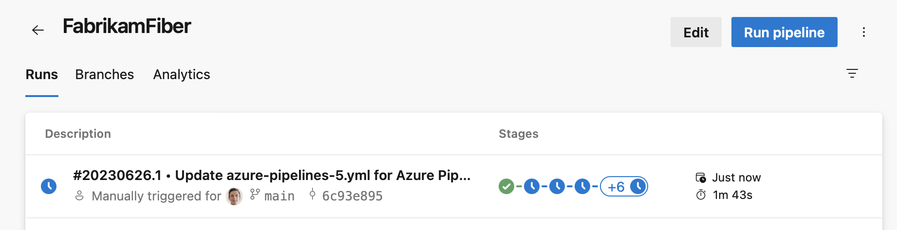

### Stage quick actions

A pipeline's **Runs** screen gives you quick access to all a runs stages. In this sprint, we've added a stages panel from where you can perform actions for each stage. For example, you can easily rerun failed jobs or rerun the entire stage. The panel is available when not all stages fit in the user interface, as you can see in the following screenshot.
> [!div class="mx-imgBorder"]
> 

When you click on the '+' sign in the stages column, the stages panel shows up, and then you can perform stage actions.

> [!div class="mx-imgBorder"]
> 
