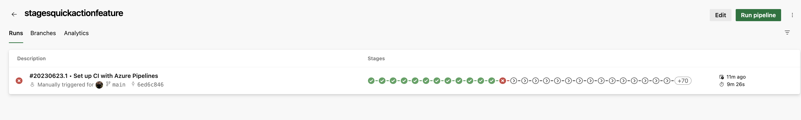
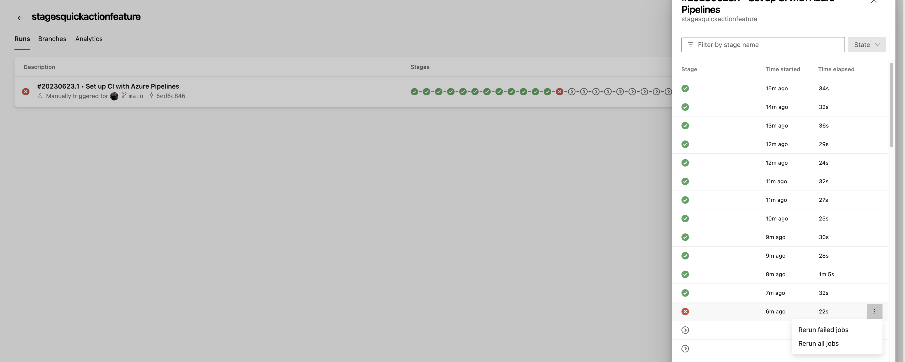

### Stage quick actions

A pipeline's **Runs** screen gives you quick access to all a runs stages. In this sprint, we've added actions to each stage, so you can easily rerun failed jobs or rerun the entire stage. This feature is available when not all stages can be shown in the user interface, as can be seen in the first image below.
> [!div class="mx-imgBorder"]
> 

Click on the '+' sign in the stages, the stages will be shown in the UI to select the options.

> [!div class="mx-imgBorder"]
> 
