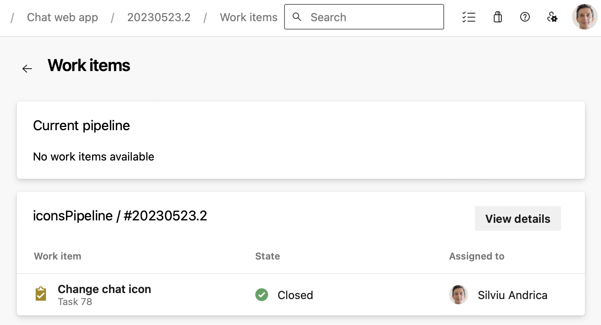

### Improvements to YAML pipeline traceability

If you have a pipeline that produces artifacts, you can consume its artifacts by defining a `pipelines` [resource](/azure/devops/pipelines/process/resources?#define-a-pipelines-resource) in another YAML pipeline.

Azure DevOps now shows the work items linked to the artifact of a _consumed_ pipeline run, not just when the _consumed_ pipeline triggered the _consuming_ pipeline.

> [!div class="mx-imgBorder"]
> 

### Automatic tokens created for Kubernetes Service Connection

Since Kubernetes 1.24, tokens were no longer created automatically when creating a new Kubernetes Service Connection. We have added this functionality back. However, it is recommended to use the Azure Service connection when accessing AKS, to learn more see [the Service Connection guidance for AKS customers using Kubernetes tasks blog post](https://devblogs.microsoft.com/devops/service-connection-guidance-for-aks-customers-using-kubernetes-tasks/).

### Preview of macOS 13 Ventura for Azure Pipeline hosted pools 

The macOS 13 image is now available in preview for Azure Pipelines hosted agents. To use this image, update your YAML file to include `vmImage:'macos-13'`:  

```yaml
- job: macOS13
  pool:
    vmImage: 'macOS-13'
  steps:
  - bash: |
      echo Hello from macOS Ventura Preview
      sw_vers
```

Please note, the macos-latest image label will continue to point to macos-12 until macos-13 comes out of preview later this year. While the macOS 13 image is in preview, it currently doesn't support all of the tooling available in macOS 13 and you may experience longer queue times than other images. 

For more information, check the [runner-images repository](https://github.com/actions/runner-images/issues/6426) and [macOS image configurations](https://github.com/actions/runner-images/tree/main/images/macos).

