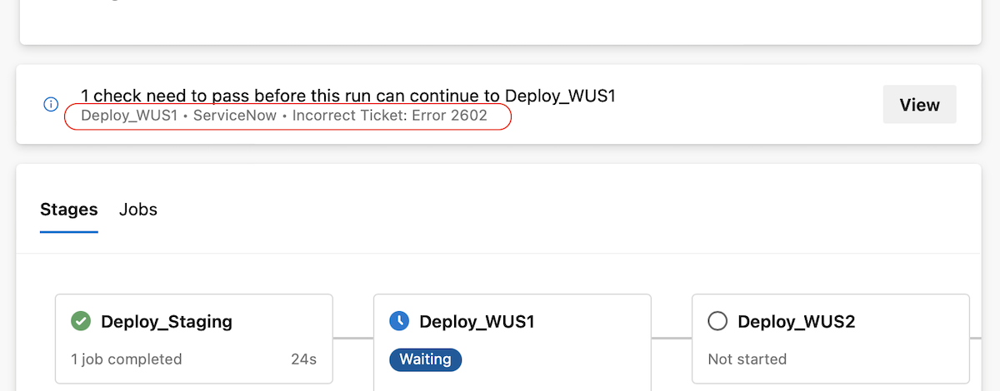
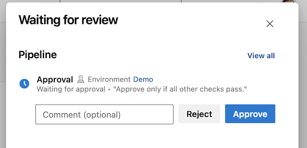

### Checks user experience improvements

We are making reading checks logs easier. Checks logs provide information critical for your deployment's success. They can tell you if you forgot to close a work item ticket, or that you need to update a ticket in ServiceNow. Previously, knowing that a check provided such critical information was hard.

Now, the pipeline run details page shows the latest check log. This is _only_ for checks that follow our [recommended usage](https://learn.microsoft.com/azure/devops/pipelines/process/invoke-checks).

> [!div class="mx-imgBorder"]
> 

To prevent mistakenly approved _Approvals_, Azure DevOps shows the _Instructions to approvers_ in the _Approvals and checks_ side panel in a pipeline run's detail page.

> [!div class="mx-imgBorder"]
> 


### Scalable Invoke Azure Function and REST API checks changes

[Approvals and Checks](https://learn.microsoft.com/azure/devops/pipelines/process/approvals) allow you to control if a pipeline run is allowed to access a resource. This is a runtime check that provides increased security to your YAML pipelines.

We noticed that when an organization makes extensive use of the Invoke Azure Function & REST API checks, they do not scale. That is, a modest increase in the number of running checks leads to abnormally large delays in checks execution time, negatively impacting deployment experience.

Our solution to scale Invoke Azure Function and REST API checks is to enforce checks' functionality to match [recommended usage](https://learn.microsoft.com/azure/devops/pipelines/process/invoke-checks). If you followed our guidelines, your checks are compliant and need no further changes.

[Read more about the upcoming changes](https://devblogs.microsoft.com/devops/updates-to-approvals-and-checks/).

### Instructions for manual pre-installation of Node 6 on Pipeline agents

If you use the [`pipeline-` agent feed](https://github.com/microsoft/azure-pipelines-agent/blob/master/docs/node6.md), you do not have Node 6 included in the agent. In some cases, where a Marketplace task is still dependent on Node 6 and the agent is not able to use the [NodeTaskRunnerInstaller task](https://learn.microsoft.com/azure/devops/release-notes/2023/pipelines/sprint-218-update#node-runner-download-task) (e.g. due to connectivity restrictions), you will need to pre-install Node 6 independently. To accomplish this, check out the [instructions](https://github.com/microsoft/azure-pipelines-agent/blob/master/docs/noderunner.md) on how install Node 6 runner manually.

### Pipeline task changelog

We now publish changes to Pipeline tasks to this [changelog](https://github.com/microsoft/azure-pipelines-tasks/releases). This contains the complete list of changes made to [built-in Pipeline tasks](https://learn.microsoft.com/azure/devops/pipelines/tasks/reference/?view=azure-pipelines). We have retroactively published prior changes, so the changelog provides a historical record of task updates.

### Release tasks use Microsoft Graph API

We have updated our [release tasks](https://learn.microsoft.com/azure/devops/pipelines/tasks/reference/?view=azure-pipelines#deploy-tasks) to use the Microsoft Graph API. This removes the usage of the [AAD Graph API](https://techcommunity.microsoft.com/t5/microsoft-entra-azure-ad-blog/azure-ad-change-management-simplified/ba-p/2967456) from our tasks.

### Specify agent version in Agent VM extension

Azure VM's can be included in Deployment Groups using a [VM Extension](https://learn.microsoft.com/azure/devops/pipelines/release/deployment-groups/howto-provision-deployment-group-agents?view=azure-devops#install-the-azure-pipelines-agent-azure-vm-extension-using-an-arm-template). The VM extension has been updated to optionally specify the desired agent version to be installed:
```
    "properties": {
      ...
      "settings": {
        ...
        "AgentMajorVersion": "auto|2|3",
        ...
      },
      ...
     }
```
