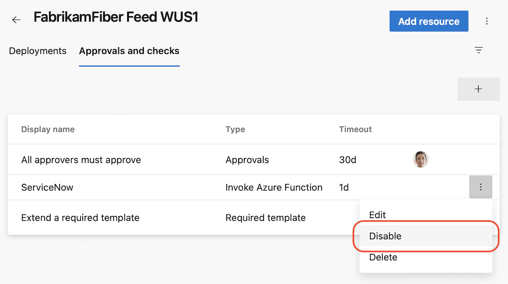
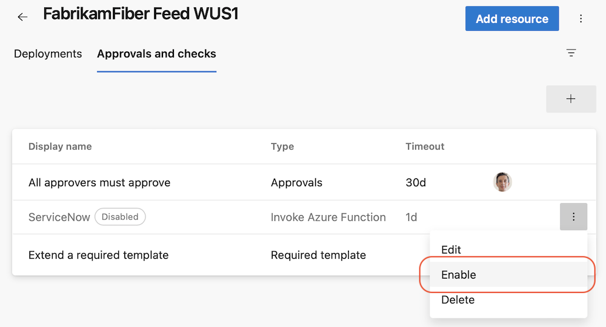

### Kubernetes tasks now support kubelogin

We have updated the  [KuberentesManifest@1](https://learn.microsoft.com/azure/devops/pipelines/tasks/reference/kubernetes-manifest-v1?view=azure-pipelines), [HelmDeploy@0](https://learn.microsoft.com/azure/devops/pipelines/tasks/reference/helm-deploy-v0?view=azure-pipelines), [Kubernetes@1](https://learn.microsoft.com/azure/devops/pipelines/tasks/reference/kubernetes-v1?view=azure-pipelines) and [AzureFunctionOnKubernetes@1](https://learn.microsoft.com/azure/devops/pipelines/tasks/reference/azure-function-on-kubernetes-v1?view=azure-pipelines) tasks to support [kubelogin](https://learn.microsoft.com/azure/aks/managed-azure-ad#non-interactive-sign-in-with-kubelogin). This allows you to target Azure Kubernetes Service (AKS) configured with [Azure Active Directory integration](https://learn.microsoft.com/azure/aks/managed-azure-ad).

Kubelogin is not pre-installed on [Hosted images](https://learn.microsoft.com/azure/devops/pipelines/agents/hosted?view=azure-devops&tabs=yaml). To make sure above mentioned tasks use kubelogin, install it by inserting the [KubeloginInstaller@0](https://learn.microsoft.com/azure/devops/pipelines/tasks/reference/kubelogin-installer-v0?view=azure-pipelines) task before the task that depends on it:

```yaml
 - task: KubeloginInstaller@0

 - task: HelmDeploy@0
   # arguments do not need to be modified to use kubelogin

```

### Use Service Principal in Agent VM extension

Azure VM's can be included in Deployment Groups using a [VM Extension](/azure/devops/pipelines/release/deployment-groups/howto-provision-deployment-group-agents?view=azure-devops#install-the-azure-pipelines-agent-azure-vm-extension-using-an-arm-template). The VM extension has been updated to optionally use a Service Principal instead of a PAT to register the agent:

```
"settings": {
  "userServicePrincipal": true
}
"protectedSettings": {
  "clientId": "<clientId>",
  "clientSecret": "<clientSecret>",
  "tenantId": "<tenantId>"
}
```

### Improvements to Approvals REST API

[Approvals](https://learn.microsoft.com/azure/devops/pipelines/process/approvals?view=azure-devops&tabs=check-pass#approvals) increase your YAML pipeline's security by giving you the possibility to manually review a deployment to production. We updated the [Approvals Query REST API](https://learn.microsoft.com/rest/api/azure/devops/approvalsandchecks/approvals/query) to make it more powerful. Now, you:
- Don't need to specify a list of `approvalId`s. All parameters are now optional.
- Can specify a list of `userId`s to retrieve the list of approvals pending on these users. Currently, the REST API returns the list of approvals for which the users are explicitly assigned as approvers.
- Can specify the `state` of the approvals to be returned, for example, `pending`.

Here is an example:
`GET https://dev.azure.com/fabrikamfiber/fabrikam-chat/_apis/pipelines/approvals?api-version=7.1-preview.1&userId=47acd774-9773-6c31-bbb6-5a0585695d19&state=pending` returns 
```json
{
    "count": 2,
    "value":
    [
        {
            "id": "87436c03-69a3-42c7-b5c2-6abfe049ee4c",
            "steps": [],
            "status": "pending",
            "createdOn": "2023-06-27T13:58:07.417Z",
            "lastModifiedOn": "2023-06-27T13:58:07.4164237Z",
            "executionOrder": "anyOrder",
            "minRequiredApprovers": 1,
            "blockedApprovers": [],
            "_links":
            {
                "self":
                {
                    "href": "https://dev.azure.com/fabrikamfiber/fabricam-chat/_apis/pipelines/approvals/87436c03-69a3-42c7-b5c2-6abfe049ee4c"
                }
            }
        },
        {
            "id": "2549baca-104c-4a6f-b05f-bdc4065a53b7",
            "steps": [],
            "status": "pending",
            "createdOn": "2023-06-27T13:58:07.417Z",
            "lastModifiedOn": "2023-06-27T13:58:07.4164237Z",
            "executionOrder": "anyOrder",
            "minRequiredApprovers": 1,
            "blockedApprovers": [],
            "_links":
            {
                "self":
                {
                    "href": "https://dev.azure.com/fabrikamfiber/fabricam-chat/_apis/pipelines/approvals/2549baca-104c-4a6f-b05f-bdc4065a53b7"
                }
            }
        }
    ]
}
```

### Disable a check 

We made debugging checks less tedious. Sometimes, an Invoke Azure Function or Invoke REST API check doesn't work correctly, and you need to fix it. Previously, you had to delete such checks, to prevent them from erroneously blocking a deployment. Once you fixed the check, you had to add it back and configure it correctly, making sure all the required headers are set or the query parameters are correct. This is tedious.

Now, you can just disable a check. The disabled check will not run in subsequent check suite evaluations.

> [!div class="mx-imgBorder"]
> 

Once you fix the erroneous check, you can just enable it.

> [!div class="mx-imgBorder"]
> 

### Updates to YAML cron schedules

In YAML pipelines, you can define [scheduled triggers](https://learn.microsoft.com/azure/devops/pipelines/process/scheduled-triggers?view=azure-devops&tabs=yaml#scheduled-triggers) using the `cron` YAML property.

We updated how the `batch` property works. In a nutshell, if you set `batch` to `true`, the cron schedule will _not_ run if another scheduled pipeline run is in progress. This is regardless of the version of the pipeline repository.

The following table describes how `always` and `batch` interact.

|Always|Batch| Behavior|
|-|-|-|
| `false` | `false` | Pipeline will run only if there is a change with respect to the last successful scheduled pipeline run|
| `false` | `true` | Pipeline will run only if there is a change with respect to the last successful scheduled pipeline run *and* there is no in-progress scheduled pipeline run|
| `true`| `false` | Pipeline will run according to the cron schedule|
| `true`| `true` | Pipeline will run according to the cron schedule|

For example, assume `always: false` and `batch: true`. Assume there is a cron schedule that specifies the pipeline should run every 5 minutes. Imagine there is a new commit. Within 5 minutes, the pipeline starts its scheduled run. Imagine a pipeline run takes 30 minutes to complete. Within these 30 minutes, no scheduled run takes place, regardless of the number of commits. The next scheduled run happens only _after_ the current scheduled run finishes.

Your YAML pipeline may contain multiple cron schedules, and you may want your pipeline to run different stages / jobs based on which cron schedule runs. For example, you have a nightly build and a weekly build, and you wish that during the weekly build your pipeline collect more statistics. 

We make this possible by introducing a new predefined system variable named `Build.CronSchedule.DisplayName` that contains the `displayName` property of a cron schedule.
