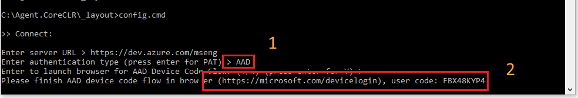
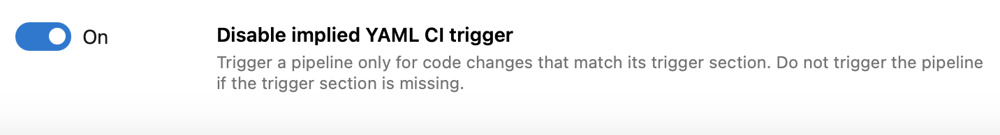
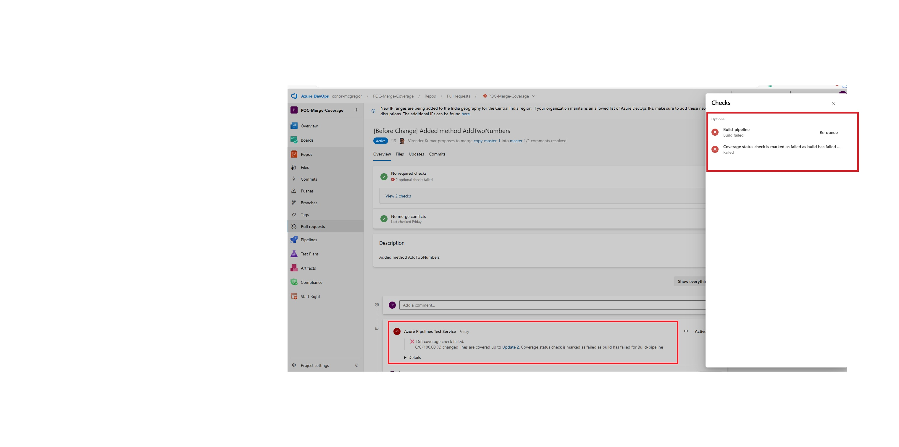
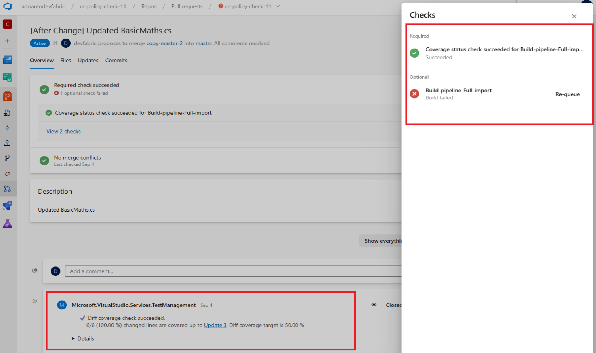

###  Pipeline agents can be registered using a Service Principal

As Azure DevOps Service Service Principals support in preview, we have added the capability to use a Service Principal to register a Pipelines agent with Azure DevOps Service:
```
--auth 'SP' --clientid 12345678-1234-1234-abcd-1234567890ab --clientsecret --tenantid 12345678-1234-1234-abcd-1234567890ab
```
You can add the Service Principal access on the security settings of an agent pool. This removes the need to use a Personal Access Token (PAT)

###  Use Service Principal in Agent VM extension

Azure VM's can be included in Deployment Groups using a [VM Extension](https://learn.microsoft.com/azure/devops/pipelines/release/deployment-groups/howto-provision-deployment-group-agents?view=azure-devops#install-the-azure-pipelines-agent-azure-vm-extension-using-an-arm-template). The VM extension has been updated to use a Service Principal instead of a PAT to register the agent:
```
"settings": {
  "userServicePrincipal": true     
}
"protectedSettings": {
  "clientId": "[parameters('clientId')]"      
  "clientSecret": "[parameters('clientSecret')]"      
  "tenantId": "[parameters('tenantId')]"      
}
```
### Azure Active Directory device code authentication flow for pipelines agent registration

The pipelines agent gained support for [Azure Entra ID Device Code Flow](https://github.com/AzureAD/microsoft-authentication-library-for-dotnet/wiki/Device-Code-Flow). You can now use a web browser to easily complete setup instead of manually creating a PAT just for one-time setup. When you run the agent configuration script, enter "AAD" for authentication type. The script will guide you through the next steps, including where to go on the web and what code to enter. After you enter your code on the web, return to the console to finish setting up the agent.

> [!div class="mx-imgBorder"]
> 

###  Public preview of Workload Identity Federation in Azure Pipelines

Want to stop storing secrets and certificates in Azure service connections? Want to stop worrying about rotating these secrets whenever they expire? We are now announcing a public preview of Workload Identity Federation for Azure service connections. [Workload identity federation](https://learn.microsoft.com/azure/active-directory/workload-identities/workload-identity-federation) uses an industry-standard technology, Open ID Connect (OIDC), to simplify the authentication between Azure Pipelines and Azure. Instead of secrets, a federation subject is used to facilitate this authentication.

As part of this feature, the Azure (ARM) service connection has been updated with an additional scheme to support Workload identity federation. This allows Pipeline tasks that use the Azure service connection to authenticate using a federation subject (sc://<org>/<project>/<service connection name>). The main benefits of using this scheme over existing authentication schemes are as follows:

Simplified management: You do not need to generate, copy, and store secrets from service principals in AAD to Azure DevOps anymore. Secrets that are used in other authentication schemes of Azure service connections (e.g., service principal) expire after a certain period (2 years currently). When they expire, pipelines fail. You have to regenerate a new secret and update the service connection. Switching to workload identity federation eliminates the need to manage these secrets and improves the overall experience of creating and managing service connections.
More secure: With workload identity federation, there is no persistent secret involved in the communication between Azure Pipelines and Azure. As a result, tasks running in pipeline jobs cannot leak or exfiltrate secrets that have access to your production environments. This has often been a concern for our customers.
You can take advantage of these features in two ways:

Use the new workload identity federation scheme whenever you create a new Azure service connection. Moving forward, this will be the recommended mechanism.
Convert your existing service connections (which are based on secrets) to the new scheme. You can do this conversion one connection at a time. Best of all, you do not have to modify any of the pipelines that use those service connections. They will automatically leverage the new scheme once you complete the conversion.
To create a new service connection using workload identity federation, simply select Workload identity federation (automatic) or (manual) in the experience.

https://github.com/microsoft/azure-pipelines-tasks/blob/users/geekzter/oidc-preview-docs/docs/service-connections/azure-oidc/create-service-connection1.png

https://github.com/microsoft/azure-pipelines-tasks/blob/users/geekzter/oidc-preview-docs/docs/service-connections/azure-oidc/create-service-connection2.png

To convert a previously created Azure service connection, select the "Convert" action after selecting the connection.

https://github.com/microsoft/azure-pipelines-tasks/blob/users/geekzter/oidc-preview-docs/docs/service-connections/azure-oidc/convert-service-connection.png

All of the Azure tasks that are included with Azure Pipelines now support this new scheme. However, if you are using a task from the Marketplace or a home-grown custom task to deploy to Azure, then it may not support workload identity federation. In these cases, we ask that you update your task to support workload identity federation to improve security. A complete list of supported tasks can be found here: https://github.com/microsoft/azure-pipelines-tasks/blob/users/geekzter/oidc-preview-docs/docs/service-connections/azure-oidc/troubleshooting.md.

For this preview, we support workload identity federation only for Azure service connections. This scheme does not work with any other types of service connections. See our docs for more details.

### REST APIs for Environments

An [Environments]() is a collection of resources that you can target with deployments from a pipeline. Environments provide you deployment history, traceability for work items and commits, and access control mechanisms.

We know you want to create environments [programmatically](https://developercommunity.visualstudio.com/t/rest-api-to-manage-environments-yaml-pipelines/859033), so we published documentation for their [REST API](https://learn.microsoft.com/en-us/rest/api/azure/devops/environments/environments/add).

### Improvements to Approvals REST API

We made searching for approvals assigned to a user more thorough by including approvals assigned to groups the user belongs to.

We made approving pending approvals easier by including information about the pipeline run they belong to.

### Prevent Unintended Pipeline Runs

Today, if your YAML pipeline doesn't specify a `trigger` section, it runs for any changes pushed to its repository. This can create confusion as to why a pipeline ran and lead to many unintended runs.

We added an organization- and project-level Pipelines setting named _Disable implied YAML CI trigger_ that lets you change this behavior. You can choose to not trigger pipelines if their trigger section is missing.

> [!div class="mx-imgBorder"]
> 

### Build GitHub Repositories Securely by Default

Last sprint, we introduced a [centralized control for building PRs from forked GitHub repos](https://learn.microsoft.com/en-us/azure/devops/release-notes/2023/sprint-226-update#centralized-control-for-building-prs-from-forked-github-repos).

Starting with this sprint, we are enabling the `Securely build pull requests from forked repositories` option at organization level, for new organizations. Existing organizations are unaffected.

### Disabled override of code coverage policy status to Failed when build is failing.

Earlier code coverage policy status was also overridden to Failed if build in PR was failing.
This was acting as a blocker for some customers where they had build as optional check and code coverage policy was a required check for PR. PRs were blocked because of it.

> [!div class="mx-imgBorder"]
> 

Results after this change : Code coverage policy won't be overridden to Failed if build fails.
This feature will be enabled for all customers.

> [!div class="mx-imgBorder"]
> 


