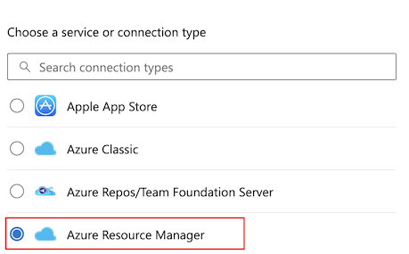
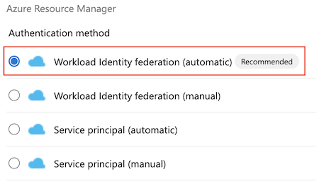

###  Workload identity federation in Azure Pipelines (public preview)

Do you want to stop storing secrets and certificates in Azure service connections? Want to stop worrying about rotating these secrets whenever they expire? We are now announcing a public preview of Workload Identity Federation for Azure service connections.[Workload identity federation](/azure/active-directory/workload-identities/workload-identity-federation) uses an industry-standard technology, Open ID Connect (OIDC), to simplify the authentication between Azure Pipelines and Azure. Instead of secrets, a federation subject is used to facilitate this authentication.

As part of this feature, the Azure (ARM) service connection has been updated with another scheme to support Workload identity federation. This allows Pipeline tasks that use the Azure service connection to authenticate using a federation subject (`sc://<org>/<project>/<service connection name>`). The main benefits of using this scheme over existing authentication schemes are as follows:

- Simplified management: You don't to generate, copy, and store secrets from service principals in Azure AD to Azure DevOps anymore. Secrets that are used in other authentication schemes of Azure service connections (e.g., service principal) expire after a certain period (two years currently). When they expire, pipelines fail. You have to regenerate a new secret and update the service connection. Switching to workload identity federation eliminates the need to manage these secrets and improves the overall experience of creating and managing service connections.  
- Improved security: With workload identity federation, there's no persistent secret involved in the communication between Azure Pipelines and Azure. As a result, tasks running in pipeline jobs can't leak or exfiltrate secrets that have access to your production environments. This has often been a concern for our customers.

You can take advantage of these features in two ways:

- Use the [new workload identity federation scheme](https://aka.ms/azdo-rm-workload-identity) whenever you create a new Azure service connection. Moving forward, this will be the recommended mechanism.
- [Convert](https://aka.ms/azdo-rm-workload-identity-conversion) your existing Azure service connections (which are based on secrets) to the new scheme. You can perform this conversion one connection at a time. Best of all, you don't have to modify any of the pipelines that use those service connections. They'll automatically apply the new scheme once you complete the conversion.

To create a new Azure service connection using workload identity federation, simply select Workload identity federation (automatic) or ([manual](https://aka.ms/azdo-rm-workload-identity-manual)) in the Azure service connection creation experience:

> [!div class="mx-imgBorder"]
> 

> [!div class="mx-imgBorder"]
> 

To convert a previously created Azure service connection, select the "Convert" action after selecting the connection:

> [!div class="mx-imgBorder"]
> 

All of the Azure tasks that are included with Azure Pipelines now support this new scheme. However, if you're using a task from the Marketplace or a home-grown custom task to deploy to Azure, then it may not support workload identity federation yet. In these cases, we ask that you update your task to support workload identity federation to improve security. A complete list of supported tasks can be found [here](https://aka.ms/azdo-rm-workload-identity-troubleshooting).

For this preview, we support workload identity federation only for Azure service connections. This scheme doesn't  work with any other types of service connections. See our docs for more details.

[This blog post](https://devblogs.microsoft.com/devops/public-preview-of-workload-identity-federation-for-azure-pipelines/) contains more details.

###  Pipeline agents can be registered using Microsoft Entra ID instead of a PAT

The Pipeline agent now supports more arguments to use either a Service Principal or a user to register an agent. You should grant the identity used access to the agent pool in its security settings. This removes the need to use a Personal Access Token (PAT) for one-time setup of agents.

####  Register an agent using a Service Principal

To use a Service Principal to register a Pipelines agent with Azure DevOps Services, provide the following arguments:
```
--auth 'SP' --clientid 00001111-aaaa-2222-bbbb-3333cccc4444 --clientsecret --tenantid aaaabbbb-0000-cccc-1111-dddd2222eeee
```
####  Use a Service Principal in the Agent VM extension

Azure VMs can be included in Deployment Groups using a [VM Extension](/azure/devops/pipelines/release/deployment-groups/howto-provision-deployment-group-agents?view=azure-devops#install-the-azure-pipelines-agent-azure-vm-extension-using-an-arm-template&preserve-view=true). The VM extension has been updated to use a Service Principal instead of a PAT to register the agent:
```
"settings": {
  "userServicePrincipal": true     
}
"protectedSettings": {
  "clientId": "[parameters('clientId')]"      
  "clientSecret": "[parameters('clientSecret')]"      
  "tenantId": "[parameters('tenantId')]"      
}
```
#### Register an agent interactively using device code flow

You can use a web browser to easily complete setup. When you run the agent configuration script, enter **"AAD"** for authentication type. The script will guide you through the next steps, including where to go on the web and what code to enter. After you enter your code on the web, return to the console to finish setting up the agent.

> [!div class="mx-imgBorder"]
> 


### REST APIs for Environments

An [Environment](/azure/devops/pipelines/process/environments?view=azure-devops&preserve-view=true) is a collection of resources that you can target with deployments from a pipeline. Environments provide you with deployment history, traceability for work items and commits, and access control mechanisms.

We know you want to create environments [programmatically](https://developercommunity.visualstudio.com/t/rest-api-to-manage-environments-yaml-pipelines/859033), so we published documentation for their [REST API](/rest/api/azure/devops/environments/environments/add).

### Prevent unintended pipeline runs

Today, if your YAML pipeline doesn't specify a `trigger` section, it runs for any changes pushed to its repository. This can create confusion as to why a pipeline ran and lead to many unintended runs.

We added an organization- and project-level Pipelines setting named _Disable implied YAML CI trigger_ that lets you change this behavior. You can choose to not trigger pipelines if their trigger section is missing.

> [!div class="mx-imgBorder"]
> 

### Build GitHub repositories securely by default

Last sprint, we introduced a [centralized control for building PRs from forked GitHub repos](/azure/devops/release-notes/2023/sprint-226-update#centralized-control-for-building-prs-from-forked-github-repos).

With this sprint, we are enabling the `Securely build pull requests from forked repositories` option at the organization level, for new organizations. Existing organizations are unaffected.

### Disabled override of code coverage policy status to Failed when build is failing

Previously in, the code coverage policy status was overridden to 'Failed' if your build in PR was failing. This was a blocker for some of you who had the build as an optional check and the code coverage policy as a required check for PRs resulting in PRs being blocked.

:::image type="content" source="../../media/227-pipelines-02.png" alt-text="Screenshot of PRs blocked." lightbox="../../media/227-pipelines-02.png":::

With this sprint, the code coverage policy won't be overridden to 'Failed' if the build fails.
This feature will be enabled for all customers.

:::image type="content" source="../../media/227-pipelines-03.png" alt-text="Screenshot of results after change." lightbox="../../media/227-pipelines-03.png":::
