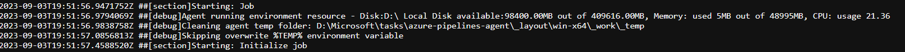

### Pipeline logs now contain resource utilization

Azure pipeline logs can now capture resource utilization metrics such as memory, CPU usage and available disk space. The logs also include resources used by the pipeline agent and child processes including tasks run in a job.

> [!div class="mx-imgBorder"]
> 

If you suspect your pipeline job may run into resource constraints, enable [verbose logs](/azure/devops/pipelines/troubleshooting/review-logs#configure-verbose-logs) to have resource utilization information injected into pipeline logs. This works on any agent, independent from hosting model.

## Azure Pipelines agent now supports Alpine Linux

The Pipeline agent v3.227 now supports [Alpine Linux](https://alpinelinux.org/) versions 3.13 and above. Alpine Linux is a popular for container (base) image. You can find the agent on the [releases](https://github.com/microsoft/azure-pipelines-agent/releases) page. Alpine Linux versions of the agent have a prefix `vsts-agent-linux-musl` e.g. `vsts-agent-linux-musl-x64-3.227.1.tar.gz`. 