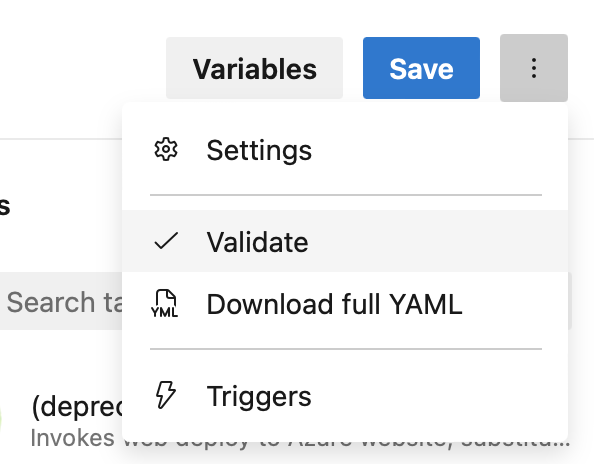
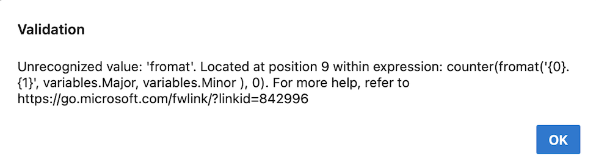
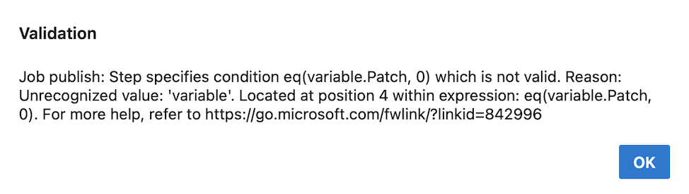

### Improved YAML validation

To verify your YAML syntax is correct, you can use the Azure Pipelines web editor's _Validate_ functionality. Thus, it's important that this functionality catch as many YAML issues as possible.

> [!div class="mx-imgBorder"]
> 

With this sprint, YAML validation is more thorough when it comes to expressions.

When writing YAML pipelines, you can use [functions](/azure/devops/pipelines/process/expressions#functions) to define variable values.

Imagine you define the following variables:
```yaml
variables:
  Major: '1'
  Minor: '0'
  Patch: $[counter(format('{0}.{1}', variables.Major, variables.Minor ), 0)]
```

The `Patch` variable is defined using the `counter` function and the other two variables. In the YAML code above, the word `format` is misspelt. Previously, this error went undetected. Now, the _Validate_ functionality will detect this and surface an error message. 

> [!div class="mx-imgBorder"]
> 

Azure Pipelines will detect incorrect variable definitions at pipeline / stage / job level.

In YAML pipelines, you can skip the execution of stage using [conditions](/azure/devops/pipelines/process/conditions). Typos can show up here as well, like in the following example.

```yml
steps:
- task: NuGetCommand@2
  condition: eq(variable.Patch, 0)
  inputs:
    command: pack
    versioningScheme: byPrereleaseNumber
    majorVersion: '$(Major)'
    minorVersion: '$(Minor)'
    patchVersion: '$(Patch)'
```

The `NuGetCommand` task executes only if the value of the `Patch` variable is 0. Again, there's a typo in the condition, and the _Validate_ functionality will display it.

> [!div class="mx-imgBorder"]
> 

Azure Pipelines will detect incorrect YAML conditions defined at pipeline / stage / job level.

### Checks scalability Phase 3

As mentioned in our [Updates to Approvals and Checks blog post](https://devblogs.microsoft.com/devops/updates-to-approvals-and-checks/), we're working toward improving our Approvals & Checks's scalability. 

Advancing into Phase 3, we'll carry out weekly, day-long brownouts, during which all pipeline runs that use non-compliant checks will fail. 

The scheduled brownout dates are:
* January 9, 2024, 08:00 UTC to January 10, 2024, 08:00 UTC
* January 16, 2024, 08:00 UTC to January 17, 2024, 08:00 UTC
* January 23, 2024, 08:00 UTC to January 24, 2024, 08:00 UTC
* January 30, 2024, 08:00 UTC to January 31, 2024, 08:00 UTC
