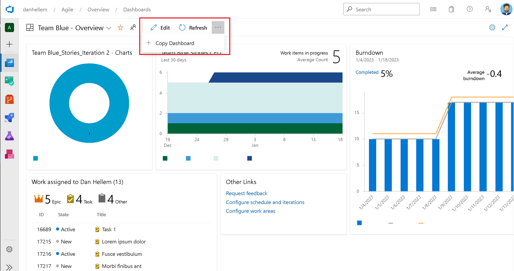

### Copy Dashboard

Back in Sprint 204 [we announced the GA release](/azure/devops/release-notes/2022/sprint-204-update#general-availability-of-copy-dashboard) of Copy Dashboard. However, you needed to turn it on in the preview features list. In this sprint, we removed it from the preview features list. It is now available to all users at all times.

> 