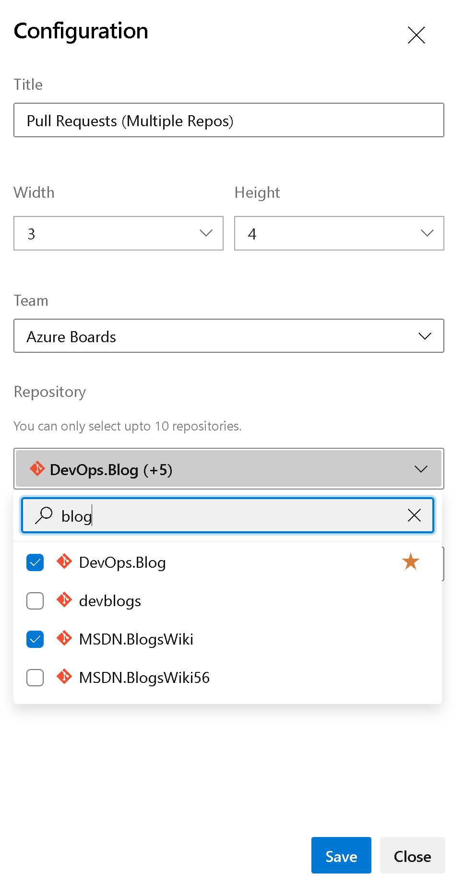

### Pull request widget for multiple repos (private preview)

The ability to have the pull request widget include multiple repos has been a [long-time request](https://developercommunity.visualstudio.com/t/allow-multiple-repository-selection-in-pull-reques/982784) in the developer community. This sprint we are happy to announce a private preview of the new widget.

> 

This new widget will allow you to see the pull requests from up to 10 different repositories in a single list.

> 

If you would like early access to this widget, please [email us directly](mailto:dahellem@microsoft.com) with your organization name.