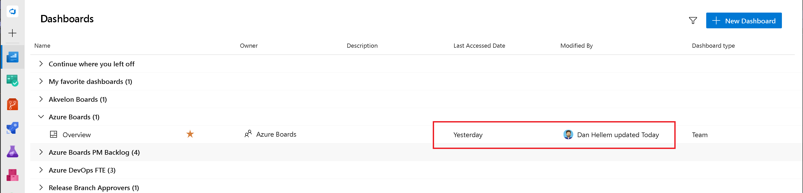

### Dashboards Last Accessed Date and Modified By

One of the downsides of allowing teams to create so many dashboards is the managing and cleanup of the outdated and unused. Knowing when a dashboard was last visited or modified is an important part to understanding which ones can be removed. In this sprint, we have included two new columns to the Dashboards directory page. Last Accessed Date will track when the dashboard was most recently visited. Modified By tracks when the dashboard was last edited and by whom. 

The **Modified By** information will also be displayed on the dashboard page itself.

> 

This new widget will allow you to see the pull requests from up to 10 different repositories in a single list.

We hope these new fields will help project administrators understand the activity level for dashboards to make an educated decision if they should be removed or not.