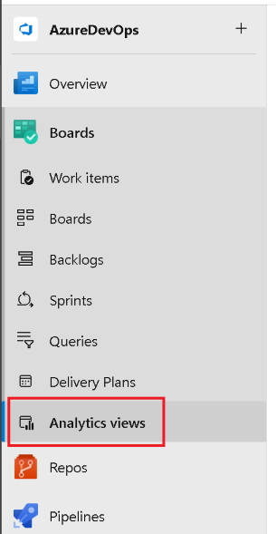

### Analytics Views are now generally available

The **Analytics Views** feature has been in a preview state for an extended period of time. Today we are happy to announce that this feature is now generally available to all organizations. 

In the navigation, **Analytics views** moved from the **Overview** tab to the **Boards** tab.

> 

An Analytics view provides a simplified way to specify the filter criteria for a Power BI report based on Analytics data. If you are not familiar with **Analytics Views**, here is some documentation to get you caught up:

- [About Analytics views](/azure/devops/report/powerbi/what-are-analytics-views?view=azure-devops&preserve-view=true )
- [Create an Analytics view in Azure DevOps](/azure/devops/report/powerbi/analytics-views-create?view=azure-devops&preserve-view=true )
- [Manage Analytics views](/azure/devops/report/powerbi/analytics-views-manage?view=azure-devops&preserve-view=true )
- [Create a Power BI report with a default Analytics view](/azure/devops/report/powerbi/create-quick-report?view=azure-devops&preserve-view=true )
- [Connect to Analytics with Power BI Data Connector](/azure/devops/report/powerbi/data-connector-connect?view=azure-devops&preserve-view=true )