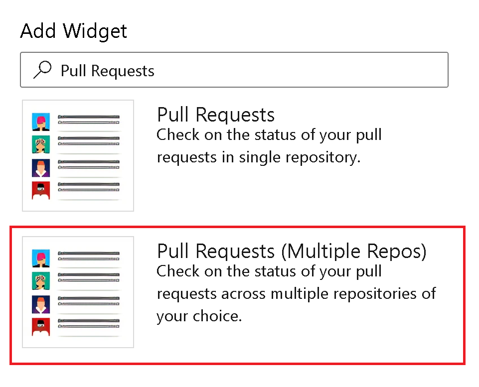

### Pull Request widget for multiple repos is now generally available

We are thrilled to announce the general availability of the Pull Request widget for multiple repositories. With this new widget, you can effortlessly view pull requests from up to 10 different repositories in a single, streamlined list, making it easier than ever to stay on top of your pull requests.

> 

[Community suggestion ticket](https://developercommunity.visualstudio.com/t/allow-multiple-repository-selection-in-pull-reques/982784)