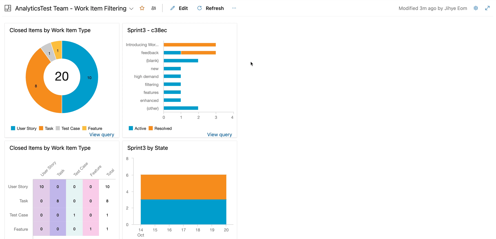

### Work item filtering

Introducing, **work item chart filtering** that enables you to not only hover over your work item chart for a quick overview but also drill down into specific chart segments for detailed insights. No need to create custom queries any more to access the exact piece of data you need. Dive into your work items in work item chart now – all in just a few clicks.

 > [!div class="mx-imgBorder"]
> 
 
Your feedback is invaluable in shaping the future of this feature. Try it now and let us know what you think in our [Azure DevOps community](https://developercommunity.visualstudio.com/AzureDevOps).  