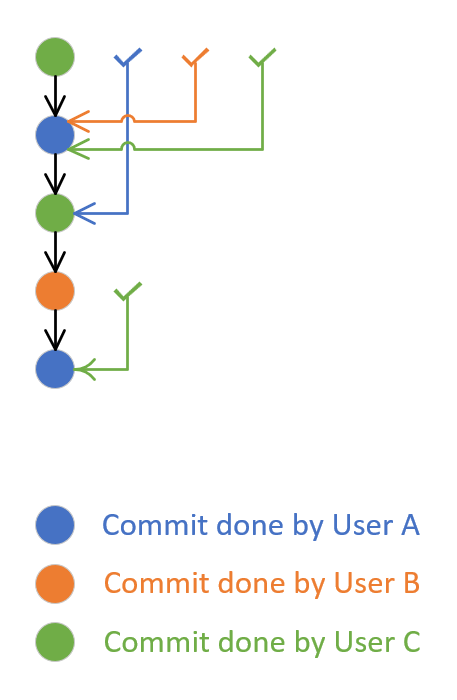

### New "Branch policy" preventing users to approve their own changes

To improve the control around what changes user approves and match stricter regulatory/compliance requirements, we do provide an option to prevent user approving his own changes unless explicitly allowed.

User with ability to manage the branch policies can now switch newly added option "Require at least one approval on every iteration" under the "When new changes are pushed".
When this option is selected, then at least one approval vote for the last source branch change is required.
The user's approval is not counted against any previous unapproved iteration pushed by that user.
As a result, additional approval on the last iteration is required to be done by another user.

Following image shows pull request created by user A and additional 4 commits (iterations) made to that pull request by users B, C, A again and C.
After the second iteration (commit done by user B) was done, user C approved that.
At that time, it implied approval of first commit of user A (when the pull request was created) and the newly introduced policy will succeed.
After the fifth iteration (last commit of user C), the approval was done by user A.
This implied approval for earlier commit done by user C, but was not implying approval for the second commit done by user A in the fourth iteration.
To make the newly introduced policy to succeed, the unapproved iteration four must be approved either by approval from user B, C or any other user who has not made any change to the pull request.

> [!div class="mx-imgBorder"]
> 
