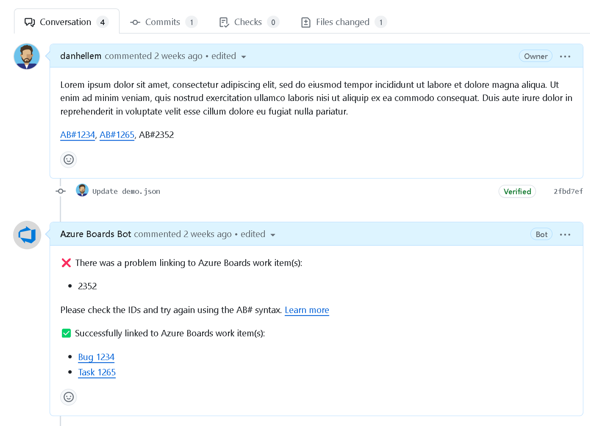
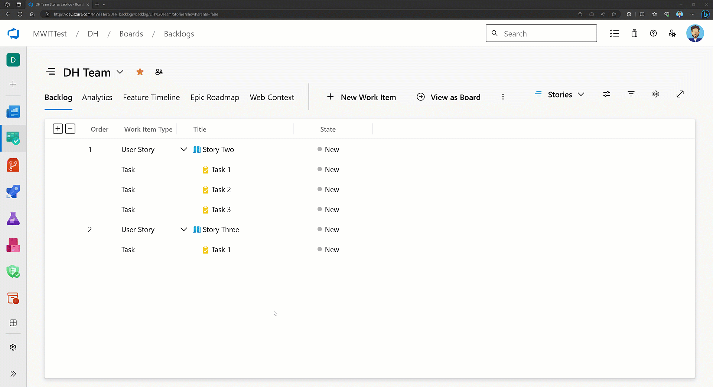

### GitHub Integration - Improved AB# validation is generally available

A few sprints ago we announced the preview for [improved AB# validation](/azure/devops/release-notes/2023/sprint-230-update#github-integration---improved-ab-validation-private-preview&preserve-view=true) by the Azure Boards App in GitHub. We've enhanced the app to better notify users about the validity of work item links, helping them spot and fix any issues before merging a Pull Request.

After several weeks of testing and feedback, this feature is now available to all users using the GitHub + Azure Boards integration.

> [!div class="mx-imgBorder"]
> 

This is the first of several features we're making to improve the current integration. Be sure to check out the other [Azure Boards + GitHub integration features](/azure/devops/release-notes/features-timeline#improved-boards--github-integration&preserve-view=true) we have planned on the public roadmap.

> [!IMPORTANT]
> As of 8/6/2024, the Azure Boards App in GitHub will no longer validate AB# links. You can still use the `AB#` syntax to link work items in your GitHub pull requests, commits, and issues as you could prior to this change.

### Team Automation Rules is generally available

We're happy to announce the release of this feature to all customers of Azure DevOps Service. 

> [!NOTE]
> This feature will roll out over the next two to three weeks. It may not be available to your organization until early February 2024.

You can now configure each backlog level to automate the opening and closing (or resolving) of work items based on the state of the child items. There are two main scenarios we're attempting to solve.

- When a single child item is activated, then activate the parent.
- When all child items are closed, then close the parent (or resolve it).

To enable these settings, click on the backlog level configuration for your team. Then go to the **Automation > Rules tab** to see the two different rules you can apply to your backlog. Each backlog level (requirements, features, epics) can be configured differently depending on how your team wants to work.

> [!div class="mx-imgBorder"]
> 

For example, when any child Task is set to Active, make the parent User Story active. Then, when all Tasks are completed, set the User Story to Closed.

> [!div class="mx-imgBorder"]
> 

You can learn more about this feature by reviewing [the documentation](/azure/devops/boards/backlogs/automate-work-item-state-transitions?view=azure-devops&preserve-view=true) and [this blog post](https://devblogs.microsoft.com/devops/team-backlog-automation-rules-private-preview/).

This feature was prioritized based on [this Developer Community suggestion ticket](https://developercommunity.visualstudio.com/t/update-automatically-user-story-state-according-to/376465).
