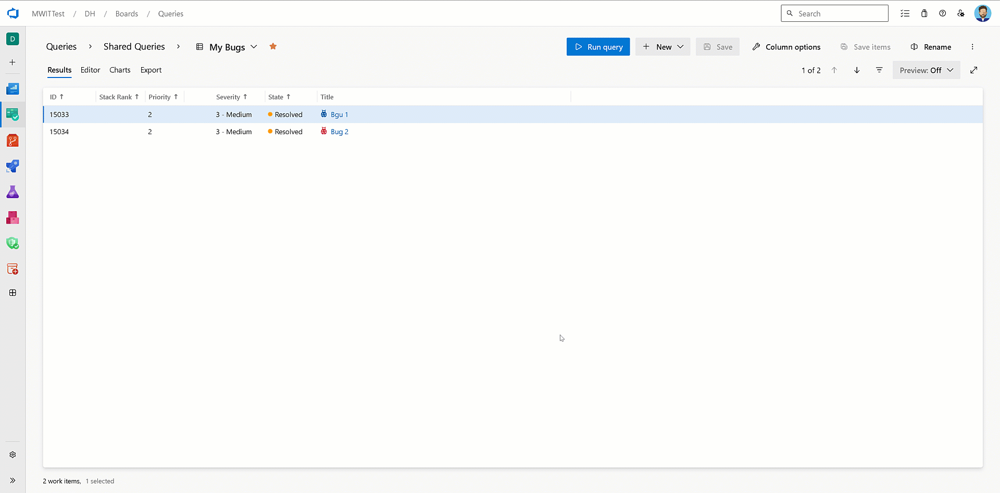
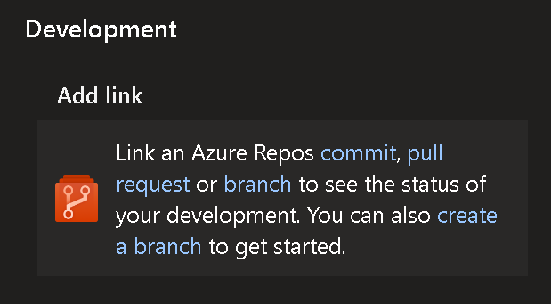
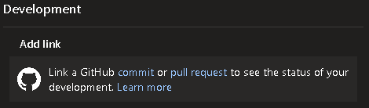
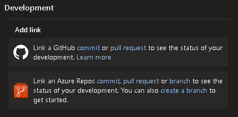

### Add link to GitHub commit or pull request (preview)

You have two options to connect your work item with a GitHub pull request or commit. You can either use the AB# syntax in the pull request, or you can link it directly from the work item. Today, the process involves copying the URL of the GitHub pull request and pasting it when adding a link. This requires opening multiple windows and switching between GitHub and Azure DevOps.

In this sprint, we're excited to announce an enhanced experience by enabling search functionality when linking to a GitHub pull request or commit. Search and select the desired repository and drill down to find and link to the specific pull request or commit. No more need for multiple window changes and copy/paste (although you still have that option).

> [!div class="mx-imgBorder"]
> 

> [!NOTE] 
>This feature is only available in the [New Boards Hub preview](/azure/devops/release-notes/2022/sprint-202-update#new-boards-hubs-now-available-in-public-preview).

If you're interested in getting access to this feature, send us an [email directly](mailto:dahellem@microsoft.com) along with your organization name ***(dev.azure.com/{organization name})***.

### New Boards Hub Improvements

With this release, we have introduce a range of enhancements to the New Boards Hub preview, focusing on accessibility and page reflow.

Here's an example of the page reflow changes that are adaptive up to 400% zoom.

> [!div class="mx-imgBorder"]
> 

Furthermore, we have rolled out performance enhancements across the work item form, boards, and backlogs pages. With these changes, you can expect New Boards to match the performance standards set with Old Boards.

### Development and Deployment Controls

We now remove the Development and/or Deployment controls from the work item, depending on how your project is configured. For example, you might configure your project settings to turn off Repos and/or Pipelines.

> [!div class="mx-imgBorder"]
> 

When you go to the work item, the corresponding Development and Deployment controls will be hidden from the form.

> [!div class="mx-imgBorder"]
> 

If you decide to [connect a GitHub repo to Azure Boards](/azure/devops/boards/github/?view=azure-devops&preserve-view=true ), the Development control for GitHub repos will be displayed.

> [!div class="mx-imgBorder"]
> 
