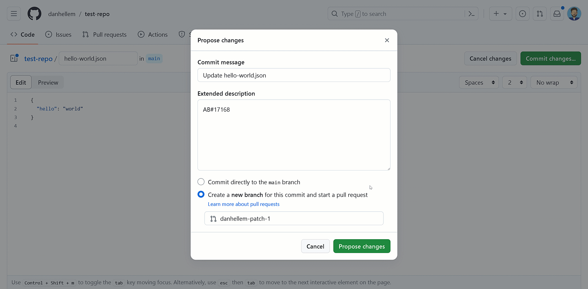

### Show GitHub pull request details (preview)

In the existing integration, we only show the open and closed status of a GitHub pull request on the work item. To capture more details of the activities that happen between these states, we have designed a new experience that provides more information. We now display if the pull request is in draft mode, needs a review, or has status checks running. All this, without having to open the pull request directly.

> [!div class="mx-imgBorder"]
> 

If you're interested in enrolling in the private preview, reach out directly [via email](mailto:dahellem@microsoft.com), and kindly include your organization name (dev.azure.com/{organization}).