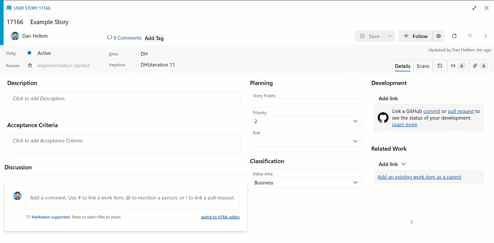

### New Boards Hub on by default

If you’ve been keeping up with the progress of New Boards Hub, you’re probably aware that the preview has been active for quite some time now. In fact, we officially [announced the preview](https://devblogs.microsoft.com/devops/new-boards-hub-public-preview/) of New Boards Hub a little over two years ago.

Today, we’re happy to announce the final stage of our journey. We're beginning the process of making New Boards Hub the default experience for all of our customers. This happens in two waves, with the first starting in the middle of April. The rollout process for each wave spans several weeks, as we gradually roll out to a different set of customers every other day. 

For more information, please see our [latest blog post here](https://devblogs.microsoft.com/devops/new-boards-hub-on-as-default/).

### Add link to GitHub commit or pull request is generally available

After several weeks [in preview](https://learn.microsoft.com/azure/devops/release-notes/2024/sprint-234-update#azure-boards-1), we're excited to announce an enhanced experience for linking work items to GitHub. Search and select the desired repository and drill down to find and link to the specific pull request or commit. No more need for multiple window changes and copy/paste (although you still have that option).

> [!div class="mx-imgBorder"]
> 

> [!NOTE]
> This feature is only available in the [New Boards Hub preview](https://learn.microsoft.com/azure/devops/release-notes/2022/sprint-202-update#new-boards-hubs-now-available-in-public-preview).

### AB# links on GitHub pull requests (preview)

As part of our ongoing enhancements to the Azure Boards + GitHub integration, we're previewing a feature that improves experience with AB# links. With this update, your AB# links will now appear directly in the Development section of the GitHub pull requests. This means you can view the linked work items without the need to navigate through the pull request description or comments, resulting in easier access to those AB# links.

> [!div class="mx-imgBorder"]
> 

These links will only be available when you use AB# in the pull the request description. They won't show up if you link directly from the pull request from the work item. Removing the AB# link from the description will also remove it from the Development control.

If you're interested in participating in the preview, please reach out to us directly via email. Make sure to include your GitHub organization name (https://github.com/{organization}).

### Connect to GitHub repository search improvements (preview)

For GitHub organizations with thousands of repositories, [connecting them](https://learn.microsoft.com/azure/devops/boards/github/connect-to-github?view=azure-devops) to an Azure DevOps project has been challenging. Customers with that many GitHub repositories would encounter timeout errors or long wait times. Today we're announcing a preview that unblocks large GitHub organizations. You can now search and select across thousands of repositories without the risk of timeout issues.

We're happy to enable to this feature upon request. If you're interested, please [send us](mailto:dahellem@microsoft.com) your Azure DevOps organization name (dev.azure.com/{organization}).