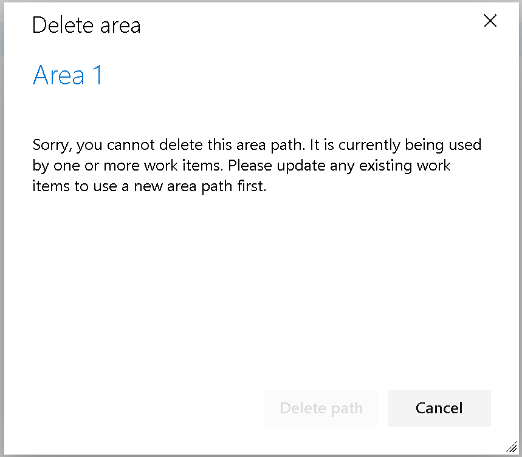

### Change for deleting area and iteration paths

Deleting an area or iteration path can be a disruptive event, as work items are moved to new area paths and teams can lose access to their boards and backlogs. Despite our warnings and confirmation prompts, customers often delete paths without fully understanding the consequences. To prevent this, we have implemented a change in behavior. Area and Iteration paths can now only be deleted if they're no longer used by any existing work items.

> [!div class="mx-imgBorder"]
> 