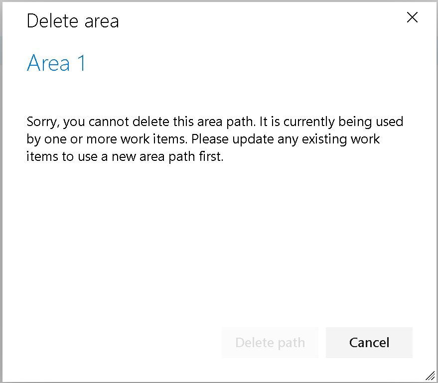

### Change for deleting area and iteration paths

Deleting an area or iteration path can be disruptive. It can move work items to a new path and may cause teams to lose access to their boards and backlogs. Despite warnings and prompts, paths are sometimes deleted without fully understanding the consequences. To address this, we changed the behavior: Area and Iteration paths can now only be deleted if they are no longer used by any work items. 

> [!div class="mx-imgBorder"]
> 