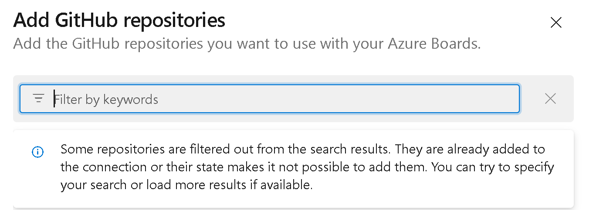
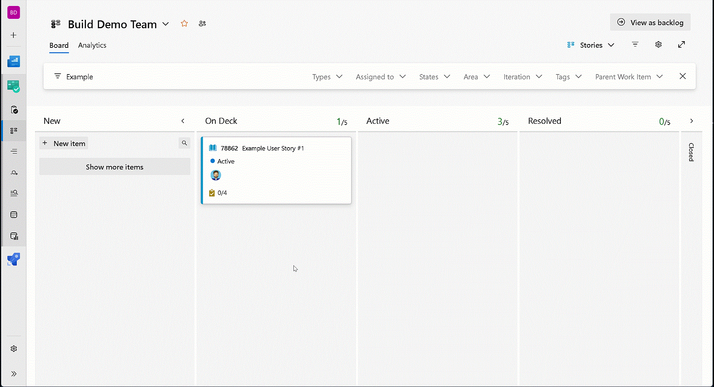

### Connect to GitHub repository search improvements

We're excited to announce an improved process for connecting an Azure DevOps project to a GitHub organization, especially beneficial for those with thousands of repositories. Previously, you might have faced challenges like timeout errors and long wait times. Our latest update optimizes the search and selection experience, eliminating the risk of timeout errors and making the connection process smoother and more efficient. 

> [!div class="mx-imgBorder"]
> 

### Create GitHub branch from work item

Now, you can create a GitHub branch directly from a work item within Azure DevOps. The "New GitHub Branch" link is available whenever a [GitHub connection is configured](/azure/devops/boards/github/connect-to-github?view=azure-devops) for your project. This link is available in all work item context menus, including the work item form, card, backlog, and queries.
To create a new branch, enter the branch name and select the desired repository and base branch.

> [!div class="mx-imgBorder"]
> 

Create GitHub branch from work item starts rolling out to the week of 7/29. It takes 2-3 weeks for the feature to reach all organizations.

> [!NOTE] 
>This feature is only available in the [New Boards Hub preview](/azure/devops/release-notes/2022/sprint-202-update#new-boards-hubs-now-available-in-public-preview).
