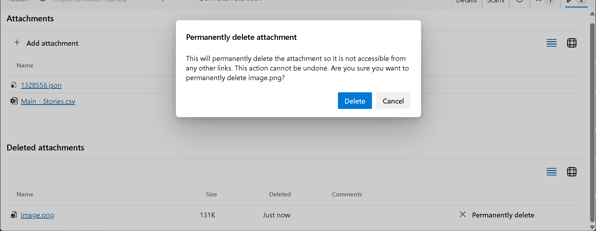

### AB# links on GitHub pull requests

As part of our ongoing enhancements to the Azure Boards + GitHub integration, we’re excited to introduce a new feature that streamlines how AB# links are displayed. With this update, AB# links now appear directly in the Development section of GitHub pull requests, making it easier to access linked work items without searching through descriptions or comments.

> [!div class="mx-imgBorder"]
> 

These links will only appear when AB# is included in the pull request description. If you link directly from a work item, they won’t be displayed in the Development section. Additionally, removing the AB# link from the description removes it from the Development control.

### REST API support for connecting GitHub repositories

We're introducing new REST API endpoints that enable you to automate the addition and removal of GitHub repositories in your Azure DevOps Projects. Additionally, we increased the repository limit per connection from 500 to 2,000 when using these endpoints.

These endpoints include:

* [Listing current connections](https://learn.microsoft.com/rest/api/azure/devops/wit/github-connections/get-github-connections?view=azure-devops-rest-7.2&tabs=HTTP)
* [Listing connected repositories](https://learn.microsoft.com/rest/api/azure/devops/wit/github-connections/get-github-connection-repositories?view=azure-devops-rest-7.2&tabs=HTTP)
* [Adding and removing repositories](https://learn.microsoft.com/rest/api/azure/devops/wit/github-connections/update?view=azure-devops-rest-7.2&tabs=HTTP)

We have also [provided sample code](https://github.com/danhellem/github-boards-connection-sample) to help you get started.

### Permanently delete attachments

In some cases, simply removing an attachment from a work item may not fully resolve security risks, especially if the file is flagged as malicious. Shared links to the attachment could still be accessible across other work items, comments, or external channels. To address this, we added a feature that allows users with "Permanently delete work items" permissions to permanently remove attachments.

> [!div class="mx-imgBorder"]
> 

This action can be performed from the **Attachments** tab on the work item form, under a new section called **"Deleted Attachments"**. This section is visible only to users with the necessary permissions to permanently delete work items.

Once an attachment is permanently deleted, all associated links return a "File attachment does not exist" error.

> [!NOTE]
> This feature is only available in the New Boards Hub.
