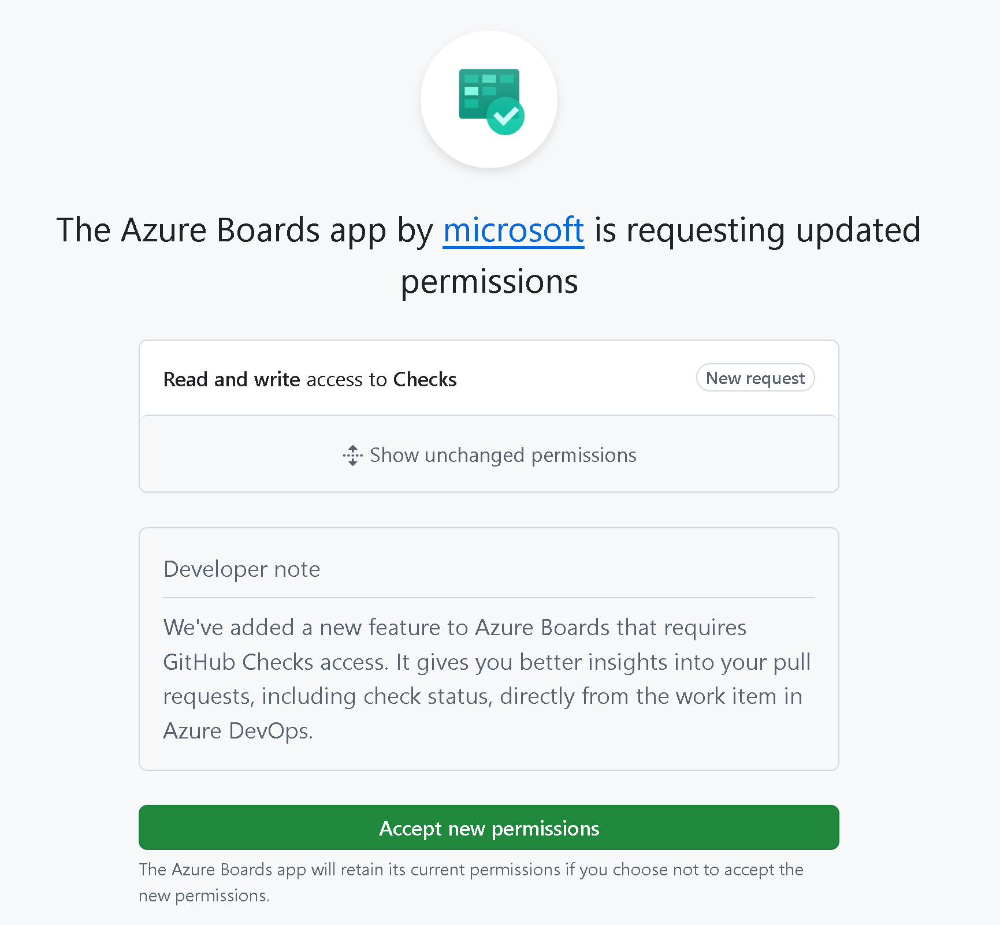

### Improved Tag Management on Work Item Form

We've enhanced tag functionality in Azure Boards. Now, when a tag is deleted, it will no longer appear in the suggested tags list on the work item form. This update ensures a cleaner and more accurate tagging experience by only showing active tags.

### Improved image support in work item comments

We’ve improved our support for pasting images into work item comments. You can now paste images from sources such as Microsoft Teams, emails, and Word documents directly into the discussion section of a work item.

### Enhanced GitHub Pull Request Insights

We’ve improved the GitHub pull request integration in Azure Boards. In addition to showing open and closed statuses, you can now see if a pull request is in draft mode, needs review, and Checks status. All without needing to open the pull request.

> [!div class="mx-imgBorder"]
> 

To enable this feature, make sure you go the Boards App in GitHub to accept the requested updated permissions for read and write access to Checks.

> [!div class="mx-imgBorder"]
> 
