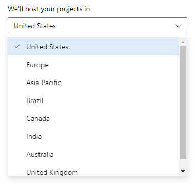

###  OAuth self-service secret rotation

Every five years, you are required to refresh your Azure DevOps OAuth app client secret to ensure the continuous creation of access and refresh tokens needed to utilize Azure DevOps APIs. When your client secret is due to expire, you can now generate your own removing the need to reach out to customer support to generate a new one. This enables your team the flexibility to schedule secret rotation at your convenience, reducing any potential downtime for your customers awaiting a replacement for an expired secret. 

> [!div class="mx-imgBorder"]
> 

Find this new functionality on each of your Azure DevOps app pages,accessible through [your profile here](https://aex.dev.azure.com/me?mkt=en-US). Learn more about this new step in our [Azure DevOps OAuth guide](/azure/devops/integrate/get-started/authentication/azure-devops-oauth?view=azure-devops&preserve-view=true).

### Select a geography when creating an organization

Select a geography, instead of a region, when creating a new Azure DevOps organization. Your closest geography is selected automatically, but you can choose a different one, based on where your team is located or because you have sovereignty requirements for your data. You can also view your geography in the overview section of organization settings.

> [!div class="mx-imgBorder"]
> 