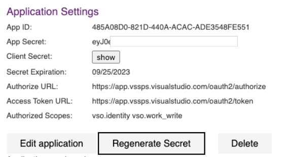

### Final notice of alternate credentials deprecation

Alternate credentials were [formally deprecated in March 2020](https://devblogs.microsoft.com/devops/azure-devops-will-no-longer-support-alternate-credentials-authentication/), but some existing users were grandfathered in with ongoing usage of their existing alternate credentials. As of January 2024 we've fully deprecating all alternate credentials.To avoid any potential disruptions, switch to one of the [available authentication mechanisms](/azure/devops/integrate/get-started/authentication/authentication-guidance?view=azure-devopsthe&preserve-view=true) we provide, such as personal access tokens or managed identities.

### Azure Devops OAuth self-service secret rotation

Every five years, it's essential to update the **Client Secret** for your Azure DevOps OAuth app, to ensure continuous generation of access and refresh tokens necessary for utilizing Azure DevOps APIs. As your **Client Secret** approaches expiration, you can now independently generate a new one, providing your team the freedom to manage it without relying on customer support. This flexibility in scheduling secret rotation minimizes potential outage time for your customers waiting for a replacement due to an expired secret.

> [!div class="mx-imgBorder"]
> 

Look for this new functionality in each of your Azure DevOps app pages that can be accessible through [your profile here](https://app.vssps.visualstudio.com/_signin?realm=app.vssps.visualstudio.com&reply_to=https%3A%2F%2Fapp.vssps.visualstudio.com%2Fprofile%2Fview&redirect=1&context=eyJodCI6MywiaGlkIjoiYTVjYTM1ZWItMTQ4ZS00Y2NkLWJiYjMtZDMxNTc2ZDc1OTU4IiwicXMiOnt9LCJyciI6IiIsInZoIjoiIiwiY3YiOiIiLCJjcyI6IiJ90#ctx=eyJTaWduSW5Db29raWVEb21haW5zIjpbImh0dHBzOi8vbG9naW4ubWljcm9zb2Z0b25saW5lLmNvbSIsImh0dHBzOi8vbG9naW4ubWljcm9zb2Z0b25saW5lLmNvbSJdfQ2). Learn more about this new step in our [Azure DevOps OAuth guide](/azure/devops/integrate/get-started/authentication/azure-devops-oauth?view=azure-devops&preserve-view=tru).
