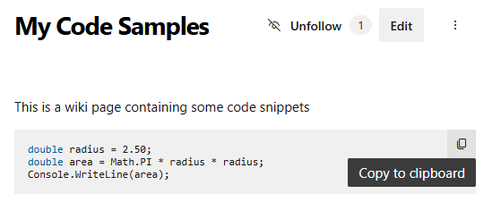
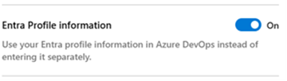

### Copy code block to clipboard

In response to your feedback in the  [developer community](https://developercommunity.visualstudio.com/t/azure-devops-vsts-wiki-copy-code-button/421282), we’ve introduced a "Copy to clipboard" button for all code blocks in rendered markdown. This enhancement is available across Wiki pages, markdown file previews in Repos, pull request discussions and descriptions, and work item discussions.
> [!div class="mx-imgBorder"]
> 

### Entra Profile information (preview)

We’re excited to introduce the integration of Entra profile information in Azure DevOps, removing the need for separate profile updates. To try the preview, enable Entra Profile Information in [Preview Features](/azure/devops/project/navigation/preview-features?view=azure-devops).

> [!div class="mx-imgBorder"]
> 

Once enabled, your [profile settings](/azure/devops/organizations/settings/set-your-preferences?view=azure-devops#set-preferences) are read-only and automatically populated from Entra. To revert to your previous settings or provide feedback, simply turn off the preview and share your comments.