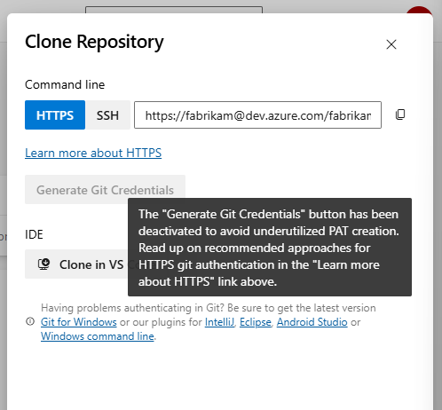

### Support sparse checkout in YAML

To help with repository checkout performance, the [git sparse-checkout](https://github.blog/open-source/git/bring-your-monorepo-down-to-size-with-sparse-checkout/) command is now supported in the YAML checkout task with two new properties: sparseCheckoutDirectories and sparseCheckoutPatterns.

Setting sparseCheckoutDirectories will enable cone mode and the checkout process will use directory-matching. You can also set sparseCheckoutPatterns which will trigger non-cone mode and allow for more complicated pattern-matching. If both properties are set, the agent will initialize cone mode with directory matching. If both properties are left out from the checkout task, the agent will disable the sparse checkout process. Any issues encountered while running the command will cause the checkout task to fail. 

YAML example for sparse checkout cone mode:
- checkout: repo
  sparseCheckoutDirectories: src

YAML example for sparse checkout non-cone mode:
- checkout: repo
  sparseCheckoutPatterns: /* !/img

### "Generate Git Credentials" button has been removed from "Clone Repository" dialogs in Repos and Wiki

We are deactivating the "Generate Git Credentials" button from the "Clone Repository" dialogs in the Repos and Wiki UI to encourage users to move to Microsoft Entra tokens when authenticating these git operations. Previously, clicking this button would generate a new personal access token (PAT) with "vso.code" scope that remains active for 7 days. Each time the button is pressed, a new PAT would be generated resulting in the creation of numerous, unused PATs per user.

> [!div class="mx-imgBorder"]
> 

Users are recommended to explore using Entra tokens in lieu of PATs when conducting ad-hoc git clone operations for code and wiki repositories. The docs have guidance on how to do so via [command line](https://learn.microsoft.com/azure/devops/repos/git/auth-overview?view=azure-devops) or within the [Git Credential Manager](https://learn.microsoft.com/azure/devops/repos/git/set-up-credential-managers?view=azure-devops) (GCM).

PATs can still be used for git operations, but in order to do so, users must create a PAT with the appropriate "vso.code" scope in their Personal Access Token page themselves. Make sure that such PATs only live for as long as they are needed and revoked after they are not used. As a reminder, in general, PATs ought to be securely stored in a secret management service like Azure Key Vault (AKV) and regularly rotated. 

