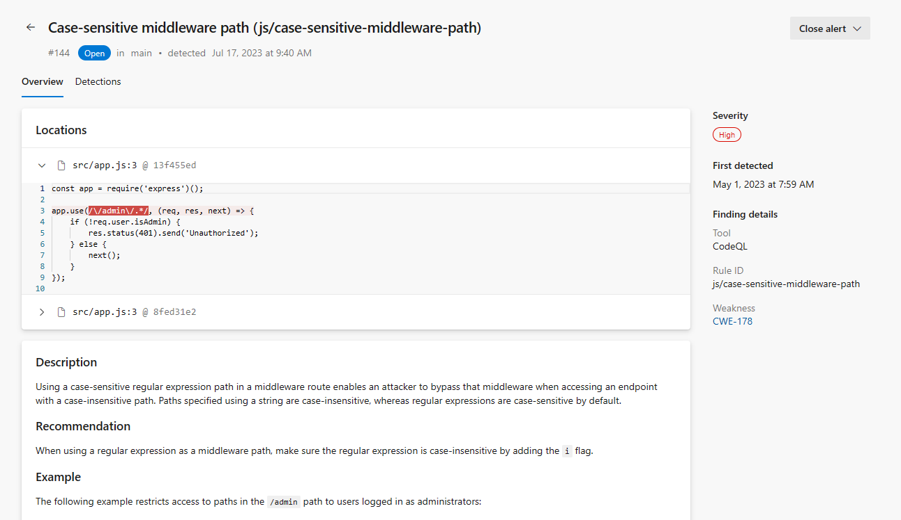
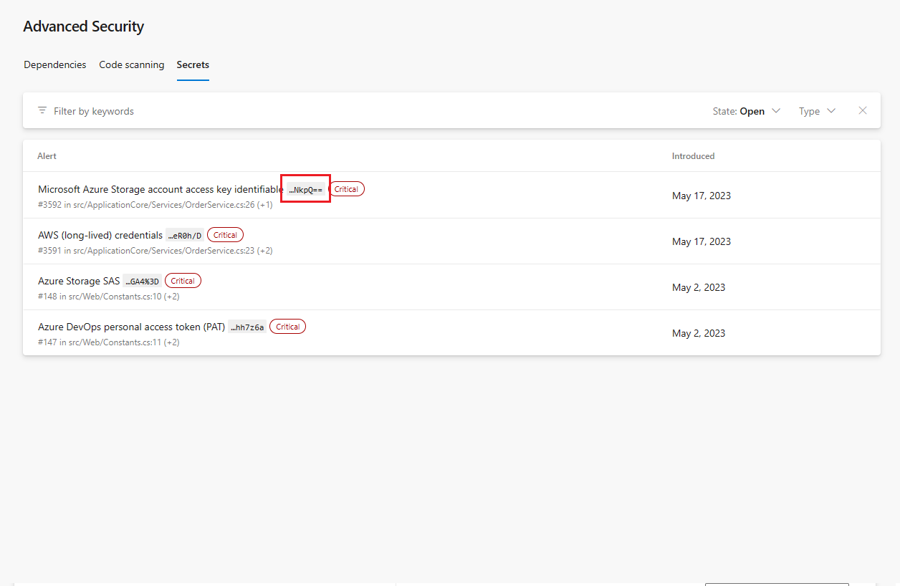
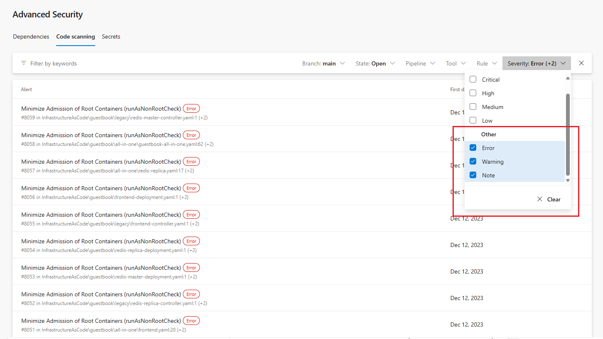
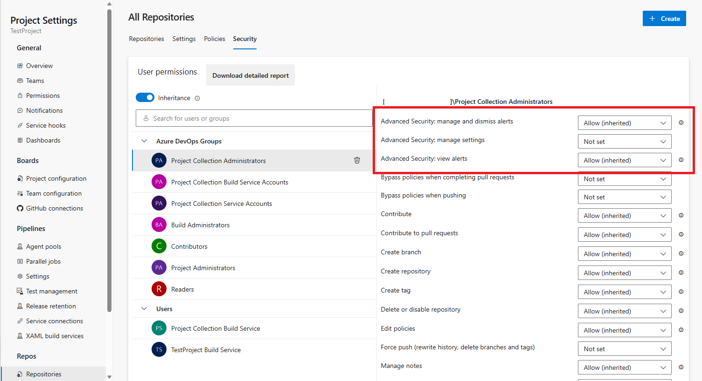

### Code snippets now available in alert details view

The alert detail page for code scanning and secret scanning alerts now shows code snippets that mark the one or more lines of code where the alert occurred. To go to the original file in your Azure DevOps repository, click on the file name above the code snippet. 

> [!div class="mx-imgBorder"]
> 

### Truncated secrets displayed in alert overview 

The truncated, last six characters of any detected secrets are now displayed in the secrets alert overview screen. This feature is helpful if you have multiple secret exposures of the same secret type, allowing you to quickly identify where particular secrets live.

> [!div class="mx-imgBorder"]
> 

### More alert severities added for code scanning alerts 

New alert severities now exist for alert results from the CodeQL `quality` queries as `Error`, `Warning`, and `Note` severities. Each quality alert severity has its own badge and color to denote scaling severities. You can also filter for each of these severities, similar to the `low` to `critical` severity scale for security alerts. 

> [!div class="mx-imgBorder"]
> 

### Linked Azure subscription required for GitHub Advanced Security for Azure DevOps enablement

If you previously enabled Advanced Security for repositories in an Azure DevOps organization without a linked Azure subscription, you may notice Advanced Security automatically disabled itself on those repositories. To re-enable Advanced Security, add an associated Azure subscription to the organization. For more information on how to add or change your subscription, see [Change Azure subscription](/azure/devops/organizations/billing/change-azure-subscription?view=azure-devopsthe&preserve-view=true).

### Advanced Security API updates 

Various updates to the Advanced Security APIs recently shipped: 
* The GET Alerts API now supports a new parameter, `ModifiedSince`, to return an incremental list of alerts and only return alerts that were modified since this date. For more information, see [Alerts - List](/rest/api/azure/devops/advancedsecurity/alerts/list).
* There are two new endpoints to fetch or update an organization or project's Advanced Security enablement status. Both endpoints return a list of repositories with Advanced Security enabled. For more information, see [Org - Enablement](/rest/api/azure/devops/advancedsecurity/org-enablement) or [Project - Enablement](/rest/api/azure/devops/advancedsecurity/project-enablement).
* There are two new endpoints to fetch an estimate of your active committer count for an organization or project to reflect what your estimated Advanced Security meter usage may cost. For more information, see [Org Meter Usage Estimate](/rest/api/azure/devops/advancedsecurity/org-meter-usage-estimate/list) or [Project Meter Usage Estimate](/rest/api/azure/devops/advancedsecurity/project-meter-usage-estimate/list).

### Advanced Security permissions are now permanently displayed 

In the past, the three Advanced Security permission bits would only be present as per-repository assignable permissions if Advanced Security was enabled. Now, these permissions are available by default at the **Repositories > Security** permissions pane and can be assigned without having Advanced Security to be enabled. 

> [!div class="mx-imgBorder"]
> 
