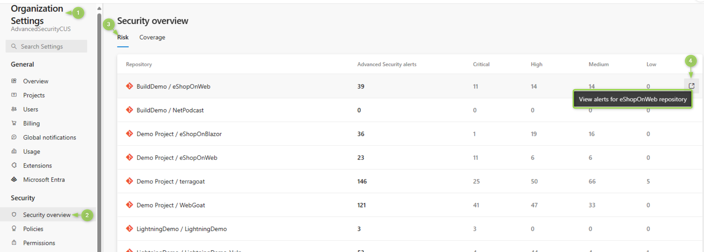

### Security overview risk view links to repository alerts

The security overview risk page now links directly to each repository's individual Advanced Security alerts page. Similar to the coverage page, for a particular repository, hover over the row and click on the icon on the right side of the row to navigate directly to the alerts page.

> [!div class="mx-imgBorder"]
> 

### Publish task for integrating with third-party providers

The **AdvancedSecurity-Publish@1** task allows you to easily retrieve results from third-party providers, enhancing the integration with GitHub advanced security for AzureDevOps These providers can include both open-source and commercial security analysis pipeline tasks that generate results in the conforming SARIF format. By leveraging this, you can now view the results within the Advanced Security Code Scanning alerts hub, providing a unified view of code security alerts from currently supported analysis tools directly within Azure DevOps. This integration supports SARIF 2.1, offering you a comprehensive overview of their security posture.

For detailed instructions on configuring code scanning in GitHub Advanced Security with Azure DevOps, see [Set up code scanning](/azure/devops/repos/security/configure-github-advanced-security-features?view=azure-devops&tabs=yaml#set-up-code-scanning). 
