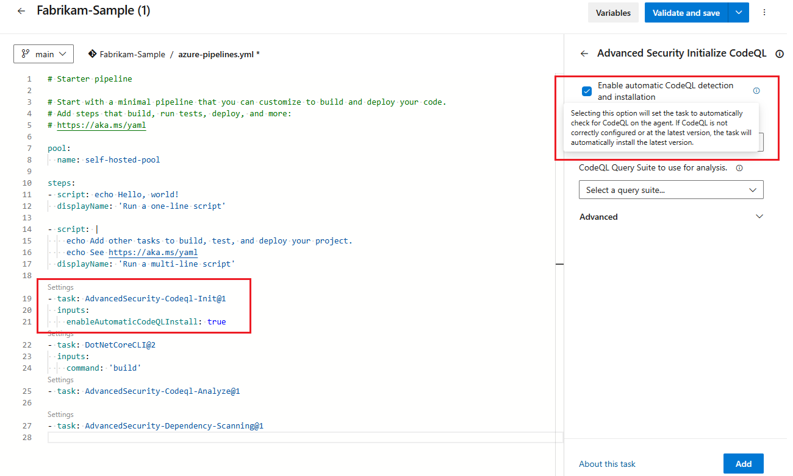

### Automated self-hosted agent install for code scanning bits in Advanced Security

To simplify using self-hosted agents for code scanning in Advanced Security, the latest CodeQL bits can now be automatically installed. The `Advanced-Security-Codeql-Init` task includes a new variable, `enableAutomaticCodeQLInstall: true`, for existing pipelines or a checkbox for new tasks. Previously, you had to manually install the CodeQL bundle in the agent tool directory.

> [!div class="mx-imgBorder"]
> 