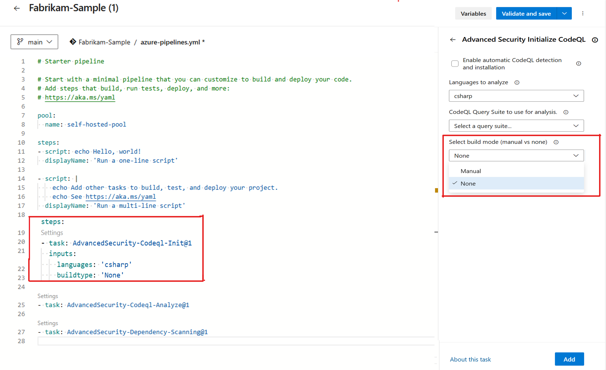

### Advanced Security meter usage API now returns user identities

To help you identify your Advanced Security users, the Meter Usage Estimate APIs now return each user’s Azure DevOps identity, including their display name, CUID, email identifier, and identity descriptor. This feature is available at the organization, project, and repository levels. To use this new endpoint, the syntax is similar to the existing meter usage API endpoints, appending `/details` to the endpoint: 

- At the organization level: GET `https://advsec.dev.azure.com/{organization}/_apis/management/meterUsageEstimate?api-version=7.2-preview.1/details`
- At the project level: GET `https://advsec.dev.azure.com/{organization}/{project}/_apis/management/meterUsageEstimate?api-version=7.2-preview.1/details`
- At the repository level: GET `https://advsec.dev.azure.com/{organization}/{project}/_apis/management/repositories/{repository}/meterUsageEstimate?api-version=7.2-preview.1/details`

### Advanced Security code scanning for C# and Java projects without builds

Code scanning with CodeQL involves running queries on databases that represent the code in your repository for a single language. For compiled languages like C/C++, C#, Go, Java, and Swift, this typically requires building the code first.

However, CodeQL, the static analysis engine behind GitHub Advanced Security for Azure DevOps, can now scan C# and Java projects without needing a build. When the build mode is set to **"none,"** the CodeQL database is generated directly from the codebase, bypassing the build step.

For all compiled languages, the default build mode is **"manual."** However, for C# and Java, you can change the build mode to **"none."** 

You can configure the build mode during the AdvancedSecurity-Codeql-Init@1 setup. For detailed instructions on configuring code scanning in GitHub Advanced Security with Azure DevOps, see Set up [code scanning](/azure/devops/repos/security/configure-github-advanced-security-features?view=azure-devops&tabs=yaml#set-up-code-scanning)

Consideration:
- If **"none"** is selected and a language other than supported complied languages C# or Java, the pipeline task may not work as expected. 
 - Build mode **"none"** currently works in conjunction with other interpreted languages (e.g., JavaScript, Python, Ruby).

- Valid Example: C# and JavaScript with build mode set to **"none."** (JavaScript in an interpreted language)
- Invalid Example: C#, JavaScript, and Swift with build mode set to **"none"** (Swift is not supported in build mode **"none"**).

> [!div class="mx-imgBorder"]
> 