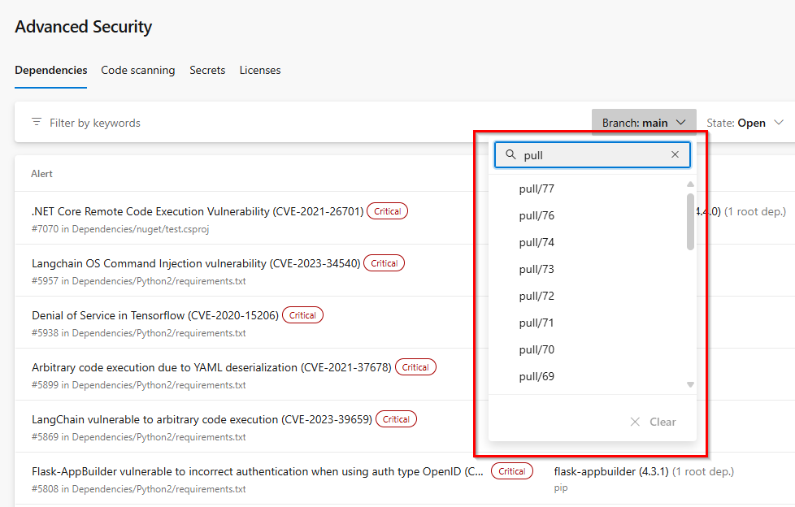

### Pull request branches appear in Advanced Security branch picker 

Pull request branches were previously hidden in the branch picker despite being able to scan on pull request branches. These results now show accordingly in the Advanced Security branch picker and are searchable. 

> [!div class="mx-imgBorder"]
> 

### Repository default branch changes now reflected in Advanced Security 

Previously, the Advanced Security repository tab did not automatically register changes to your default branch, resulting in needing to select your desired branch via the branch picker if your default branch changed. Now, the Advanced Security tab will recognize and, by default, load alerts for the newly designated default branch when you first visit the page. 

Security overview will now also respect default branch changes, although there is a longer delay in processing time before updated alert results appear after a default branch change.

### Generic third-party SARIF support for Advanced Security 

You can now upload results from your third-party scanning tool to show in the Advanced Security code scanning tab. 

Using a scanning tool that publishes a SARIF file to the `$(Agent.TempDirectory)/.advsec` directory, conforms to the SARIF 2.1 standard, and runs the [AdvancedSecurity-Publish](/azure/devops/pipelines/tasks/reference/advanced-security-publish-v1?view=azure-pipelines) after the task will upload results to the code scanning tab.

> [!NOTE]
> The file path associated with a result in the SARIF file must be accessible to the `AdvancedSecurity-Publish` task running in the build agent.

### Alert rule IDs now incorporated into result fingerprints 

Any third-party tool results that had the same partial fingerprint, line rolling hash, tool, and rule name, despite the associated rule having a different rule ID, were bundled into one alert. 

Now, rule IDs will be considered a part of the result fingerprint and appropriately create their own alerts even if other results share similar metadata. This will also update any existing alerts that have been previously bundled erroneously, splitting them into separate alerts. 

### Pull request annotations feature in (preview)

As indicated in the Advanced Security roadmap item, [Pull-request annotations](/azure/devops/release-notes/roadmap/2024/ghazdo/pull-request-annotation), you will now receive in-line annotations on any pull requests that utilize a pipeline assigned to your build validation policy with dependency scanning and/or code scanning tasks included.

There is no opt-in needed aside from creating a build validation policy to be applied against select branches.

Clicking on `Show more details` in the annotation will bring you to the alert detail view for the alert in question. 

> [!div class="mx-imgBorder"]
> 