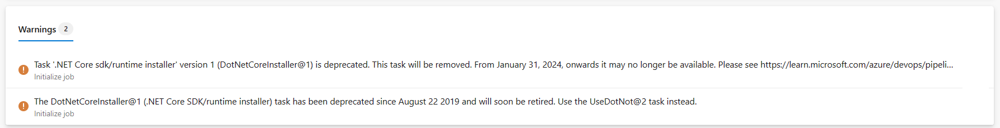

### Update deprecated tasks before January 31

We are retiring deprecated tasks on January 31, 2024. To help you identify the pipelines that are using these tasks, we have included a warning message with a suggested alternative. We encourage you to update your pipelines to use a newer task version or an alternative before January 31, 2024.

> [!div class="mx-imgBorder"]
> 

See earlier announcements related to deprecated tasks:

- [Announcing retirement of deprecated tasks](/azure/devops/release-notes/2023/pipelines/sprint-230-update?branch=pr-en-us-6451#announcing-retirement-of-deprecated-tasks)
- [Announcement for NuGet Restore v1 and NuGet Installer v0 pipeline tasks](/azure/devops/release-notes/2023/artifacts/sprint-229-update?branch=pr-en-us-6451#deprecation-announcement-for-nuget-restore-v1-and-nuget-installer-v0-pipeline-tasks)

### Microsoft hosted agents use PowerShell 7.4

All [Microsoft hosted agents](/azure/devops/pipelines/agents/hosted?view=azure-devops&tabs=yaml#software&preserve-view=true) will start using PowerShell 7.2 LTS to PowerShell 7.4 LTS from January 28. See [What's New in PowerShell 7.4](/powershell/scripting/whats-new/what-s-new-in-powershell-74?view=powershell-7.4&preserve-view=true) and [PowerShell 7.4 General Availability](https://devblogs.microsoft.com/powershell/powershell-7-4-general-availability/).

Take note of breaking changes and update your scripts accordingly:

- [Breaking changes](/powershell/scripting/whats-new/what-s-new-in-powershell-74?view=powershell-7.4#breaking-changes&preserve-view=true) between PowerShell 7.3 & 7.4 LTS
- [Breaking changes](/powershell/scripting/whats-new/what-s-new-in-powershell-73?view=powershell-7.4#breaking-changes-and-improvements&preserve-view=true) between PowerShell 7.2 LTS & 7.3
- Updated argument parsing behavior controlled via
[`$PSNativeCommandArgumentPassing`](/powershell/module/microsoft.powershell.core/about/about_preference_variables?view=powershell-7.4#psnativecommandargumentpassing&preserve-view=true). The sample script [below](#new-azure-service-connection-secrets-expire-in-three-months) enforces the same behavior across Linux, macOS & Windows by setting `$PSNativeCommandArgumentPassing` explicitly.

### New Azure service connection secrets expire in three months

Azure Service Connections where Azure DevOps creates the [secret](/azure/devops/pipelines/library/connect-to-azure?view=azure-devops#create-an-azure-resource-manager-service-connection-using-a-service-principal-secret&preserve-view=true), will have a secret expiration of three months instead of two years.

To eliminate the need to rotate secrets, [convert](/azure/devops/pipelines/library/connect-to-azure?view=azure-devops#convert-an-existing-arm-service-connection-to-use-workload-identity-federation&preserve-view=true) your service connection to use [Workload identity federation](/azure/devops/pipelines/library/connect-to-azure?view=azure-devops#create-an-azure-resource-manager-service-connection-using-workload-identity-federation&preserve-view=true) instead. You can use the below sample script to quickly convert multiple Azure service connections to Workload identity federation:

```powershell
#!/usr/bin/env pwsh
<# 
.SYNOPSIS 
    Convert multiple Azure Resource Manager service connection(s) to use Workload identity federation

.LINK
    https://aka.ms/azdo-rm-workload-identity-conversion

.EXAMPLE
    ./convert_azurerm_service_connection_to_oidc_simple.ps1 -Project <project> -OrganizationUrl https://dev.azure.com/<organization>
#> 
#Requires -Version 7.3

param ( 
    [parameter(Mandatory=$true,HelpMessage="Name of the Azure DevOps Project")]
    [string]
    [ValidateNotNullOrEmpty()]
    $Project,

    [parameter(Mandatory=$true,HelpMessage="Url of the Azure DevOps Organization")]
    [uri]
    [ValidateNotNullOrEmpty()]
    $OrganizationUrl
) 
$apiVersion = "7.1"
$PSNativeCommandArgumentPassing = "Standard" 

#-----------------------------------------------------------
# Log in to Azure
$azdoResource = "499b84ac-1321-427f-aa17-267ca6975798"
az login --allow-no-subscriptions --scope ${azdoResource}/.default
$OrganizationUrl = $OrganizationUrl.ToString().Trim('/')

#-----------------------------------------------------------
# Retrieve the service connection
$getApiUrl = "${OrganizationUrl}/${Project}/_apis/serviceendpoint/endpoints?authSchemes=ServicePrincipal&type=azurerm&includeFailed=false&includeDetails=true&api-version=${apiVersion}"
az rest --resource $azdoResource -u "${getApiUrl} " -m GET --query "sort_by(value[?authorization.scheme=='ServicePrincipal' && data.creationMode=='Automatic' && !(isShared && serviceEndpointProjectReferences[0].projectReference.name!='${Project}')],&name)" -o json `
        | Tee-Object -Variable rawResponse | ConvertFrom-Json | Tee-Object -Variable serviceEndpoints | Format-List | Out-String | Write-Debug
if (!$serviceEndpoints -or ($serviceEndpoints.count-eq 0)) {
    Write-Warning "No convertible service connections found"
    exit 1
}

foreach ($serviceEndpoint in $serviceEndpoints) {
    # Prompt user to confirm conversion
    $choices = @(
        [System.Management.Automation.Host.ChoiceDescription]::new("&Convert", "Converting service connection '$($serviceEndpoint.name)'...")
        [System.Management.Automation.Host.ChoiceDescription]::new("&Skip", "Skipping service connection '$($serviceEndpoint.name)'...")
        [System.Management.Automation.Host.ChoiceDescription]::new("&Exit", "Exit script")
    )
    $prompt = $serviceEndpoint.isShared ? "Convert shared service connection '$($serviceEndpoint.name)'?" : "Convert service connection '$($serviceEndpoint.name)'?"
    $decision = $Host.UI.PromptForChoice([string]::Empty, $prompt, $choices, $serviceEndpoint.isShared ? 1 : 0)

    if ($decision -eq 0) {

        Write-Host "$($choices[$decision].HelpMessage)"
    } elseif ($decision -eq 1) {
        Write-Host "$($PSStyle.Formatting.Warning)$($choices[$decision].HelpMessage)$($PSStyle.Reset)"
        continue 
    } elseif ($decision -ge 2) {
        Write-Host "$($PSStyle.Formatting.Warning)$($choices[$decision].HelpMessage)$($PSStyle.Reset)"
        exit 
    }

    # Prepare request body
    $serviceEndpoint.authorization.scheme = "WorkloadIdentityFederation"
    $serviceEndpoint.data.PSObject.Properties.Remove('revertSchemeDeadline')
    $serviceEndpoint | ConvertTo-Json -Depth 4 | Write-Debug
    $serviceEndpoint | ConvertTo-Json -Depth 4 -Compress | Set-Variable serviceEndpointRequest
    $putApiUrl = "${OrganizationUrl}/${Project}/_apis/serviceendpoint/endpoints/$($serviceEndpoint.id)?operation=ConvertAuthenticationScheme&api-version=${apiVersion}"
    # Convert service connection
    az rest -u "${putApiUrl} " -m PUT -b $serviceEndpointRequest --headers content-type=application/json --resource $azdoResource -o json `
            | ConvertFrom-Json | Set-Variable updatedServiceEndpoint
    
    $updatedServiceEndpoint | ConvertTo-Json -Depth 4 | Write-Debug
    if (!$updatedServiceEndpoint) {
        Write-Debug "Empty response"
        Write-Error "Failed to convert service connection '$($serviceEndpoint.name)'"
        exit 1
    }
    Write-Host "Successfully converted service connection '$($serviceEndpoint.name)'"
}
```