### Workload identity federation for Azure Resource Manager service connections is now generally available

In September, we [announced](https://devblogs.microsoft.com/devops/public-preview-of-workload-identity-federation-for-azure-pipelines/) the ability to configure Azure service connections without using a secret. Since then, many customers have adopted this feature and we're excited to announce this capability is now generally available.

If you aren't using Workload identity federation yet, you can take advantage of worry-free Azure service connections that don't have expiring secrets in the following ways:

To create a new Azure service connection using workload identity federation, select Workload identity federation (automatic) in the Azure service connection creation experience:

> [!div class="mx-imgBorder"]
> ")


To convert a previously created Azure service connection, select the "Convert" action after selecting the connection:

> [!div class="mx-imgBorder"]
> 


To convert multiple service connections, you can use automation for example, this PowerShell script:
   
```powershell
#!/usr/bin/env pwsh
<# 
.SYNOPSIS 
    Convert multiple Azure Resource Manager service connection(s) to use Workload identity federation

.LINK
    https://aka.ms/azdo-rm-workload-identity-conversion

.EXAMPLE
    ./convert_azurerm_service_connection_to_oidc_simple.ps1 -Project <project> -OrganizationUrl https://dev.azure.com/<organization>
#> 
#Requires -Version 7.3

param ( 
    [parameter(Mandatory=$true,HelpMessage="Name of the Azure DevOps Project")]
    [string]
    [ValidateNotNullOrEmpty()]
    $Project,

    [parameter(Mandatory=$true,HelpMessage="Url of the Azure DevOps Organization")]
    [uri]
    [ValidateNotNullOrEmpty()]
    $OrganizationUrl
) 
$apiVersion = "7.1"
$PSNativeCommandArgumentPassing = "Standard" 

#-----------------------------------------------------------
# Log in to Azure
$azdoResource = "499b84ac-1321-427f-aa17-267ca6975798"
az login --allow-no-subscriptions --scope ${azdoResource}/.default
$OrganizationUrl = $OrganizationUrl.ToString().Trim('/')

#-----------------------------------------------------------
# Retrieve the service connection
$getApiUrl = "${OrganizationUrl}/${Project}/_apis/serviceendpoint/endpoints?authSchemes=ServicePrincipal&type=azurerm&includeFailed=false&includeDetails=true&api-version=${apiVersion}"
az rest --resource $azdoResource -u "${getApiUrl} " -m GET --query "sort_by(value[?authorization.scheme=='ServicePrincipal' && data.creationMode=='Automatic' && !(isShared && serviceEndpointProjectReferences[0].projectReference.name!='${Project}')],&name)" -o json `
        | Tee-Object -Variable rawResponse | ConvertFrom-Json | Tee-Object -Variable serviceEndpoints | Format-List | Out-String | Write-Debug
if (!$serviceEndpoints -or ($serviceEndpoints.count-eq 0)) {
    Write-Warning "No convertible service connections found"
    exit 1
}

foreach ($serviceEndpoint in $serviceEndpoints) {
    # Prompt user to confirm conversion
    $choices = @(
        [System.Management.Automation.Host.ChoiceDescription]::new("&Convert", "Converting service connection '$($serviceEndpoint.name)'...")
        [System.Management.Automation.Host.ChoiceDescription]::new("&Skip", "Skipping service connection '$($serviceEndpoint.name)'...")
        [System.Management.Automation.Host.ChoiceDescription]::new("&Exit", "Exit script")
    )
    $prompt = $serviceEndpoint.isShared ? "Convert shared service connection '$($serviceEndpoint.name)'?" : "Convert service connection '$($serviceEndpoint.name)'?"
    $decision = $Host.UI.PromptForChoice([string]::Empty, $prompt, $choices, $serviceEndpoint.isShared ? 1 : 0)

    if ($decision -eq 0) {

        Write-Host "$($choices[$decision].HelpMessage)"
    } elseif ($decision -eq 1) {
        Write-Host "$($PSStyle.Formatting.Warning)$($choices[$decision].HelpMessage)$($PSStyle.Reset)"
        continue 
    } elseif ($decision -ge 2) {
        Write-Host "$($PSStyle.Formatting.Warning)$($choices[$decision].HelpMessage)$($PSStyle.Reset)"
        exit 
    }

    # Prepare request body
    $serviceEndpoint.authorization.scheme = "WorkloadIdentityFederation"
    $serviceEndpoint.data.PSObject.Properties.Remove('revertSchemeDeadline')
    $serviceEndpoint | ConvertTo-Json -Depth 4 | Write-Debug
    $serviceEndpoint | ConvertTo-Json -Depth 4 -Compress | Set-Variable serviceEndpointRequest
    $putApiUrl = "${OrganizationUrl}/${Project}/_apis/serviceendpoint/endpoints/$($serviceEndpoint.id)?operation=ConvertAuthenticationScheme&api-version=${apiVersion}"
    # Convert service connection
    az rest -u "${putApiUrl} " -m PUT -b $serviceEndpointRequest --headers content-type=application/json --resource $azdoResource -o json `
            | ConvertFrom-Json | Set-Variable updatedServiceEndpoint
    
    $updatedServiceEndpoint | ConvertTo-Json -Depth 4 | Write-Debug
    if (!$updatedServiceEndpoint) {
        Write-Debug "Empty response"
        Write-Error "Failed to convert service connection '$($serviceEndpoint.name)'"
        exit 1
    }
    Write-Host "Successfully converted service connection '$($serviceEndpoint.name)'"
}
```

For more information, visit our [documentation](https://aka.ms/azdo-rm-workload-identity).

### The Pipelines agent shows resource utilization issues more prominently

[Last October](/azure/devops/release-notes/2023/pipelines/sprint-228-update#pipeline-logs-now-contain-resource-utilization) we added the ability to track memory & disk space usage by the Pipelines agent.

To make customers aware, they may have resource constraints such as memory or disk space limitations on their agent, we made resource constraints more visible:

> [!div class="mx-imgBorder"]
> 

If you see any of the above messages, this may be caused by a task using more resources than the agent is dimensioned for which may result in the agent not being responsive and failing a pipeline job:

> "We stopped hearing from the agent"

In such cases, enable [verbose logs](/azure/devops/pipelines/troubleshooting/review-logs?view=azure-devops#configure-verbose-logs&preserve-view=true) to get more finer grained resource utilization messages and track where your agent ran out of resources. If you're using a Self-hosted agent, make sure your agent has adequate resources.

### Out-of-band installation of Node 6 task runner

Azure Pipelines provides two versions of agent packages:

- __vsts-agent-*__ packages support tasks using Node 6 to run.
- __pipelines-agent-*__ packages do not support tasks that require Node 6 to run.

Customers that create Self-hosted agents can download these from the Pipeline agent [releases page](https://github.com/microsoft/azure-pipelines-agent/releases). The Node versions included with the agent are used to execute tasks. See [Node runner versions](/azure/devops/pipelines/agents/agents?view=azure-devops&tabs=yaml%2Cbrowser#node-runner-versions&preserve-view=true).

After agent registration, agents installed from __pipelines-agent-*__ packages will now download Node versions that are not included with the agent and not blocked under 'Task restrictions' in organization settings. This allows customers to use __pipelines-agent-*__ agent packages and control the installation of Node 6 with 'Task restrictions' in organization settings.

### Deferred approval

Approvals can be used to sign off on a deployment. However, there are situations when the time when the approval is given and the time the deployment should start don't match. For example, for the particular deployment you review, you know it's an out-of-bounds one. Imagine it can't proceed immediately, rather it should take place during the night.

To cover such scenarios, we've added the option to defer approvals for YAML pipelines. Now, you can approve a pipeline run and specify when should the approval be effective.

> [!div class="mx-imgBorder"]
> 

When you select _Defer approval_, you can configure the time when the approval becomes effective.

> [!div class="mx-imgBorder"]
> 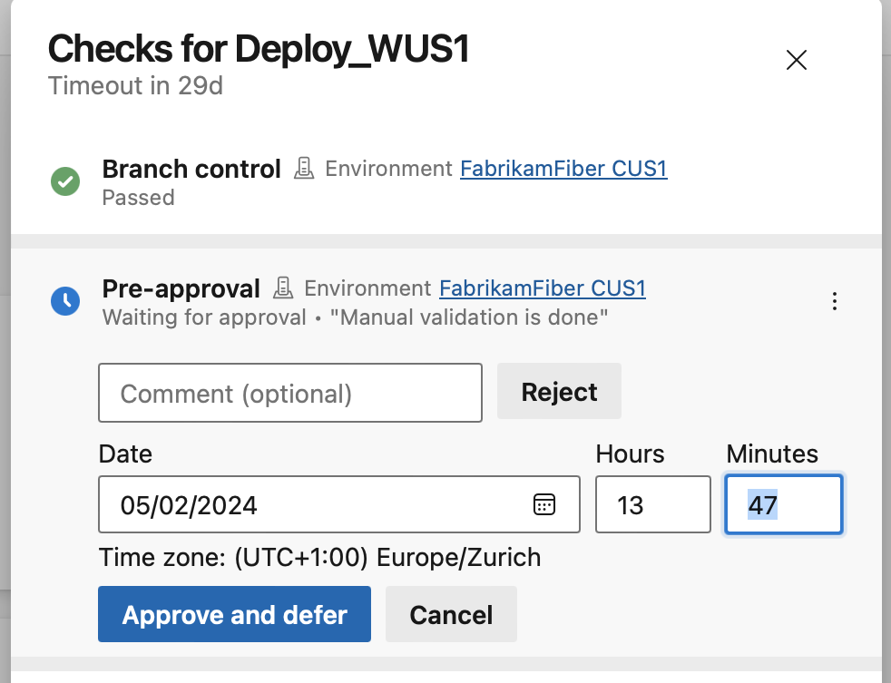

> [!div class="mx-imgBorder"]
> 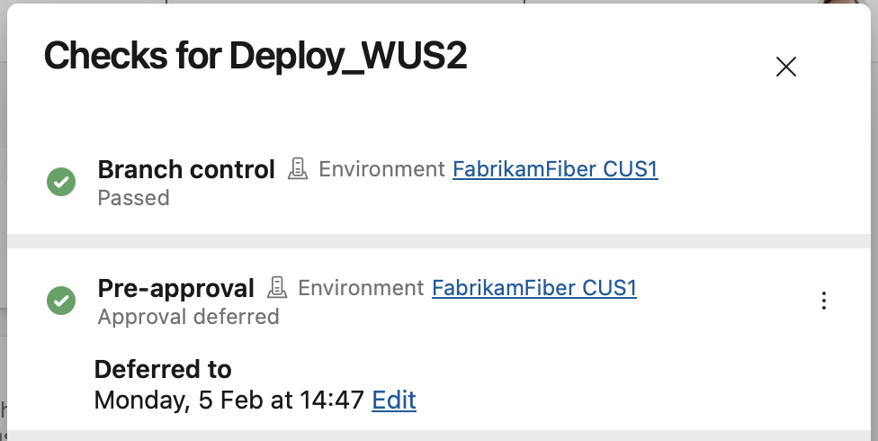

The approval shows up as deferred in the checks panel. After the deferred-to time, the approval is effective.

> [!div class="mx-imgBorder"]
> 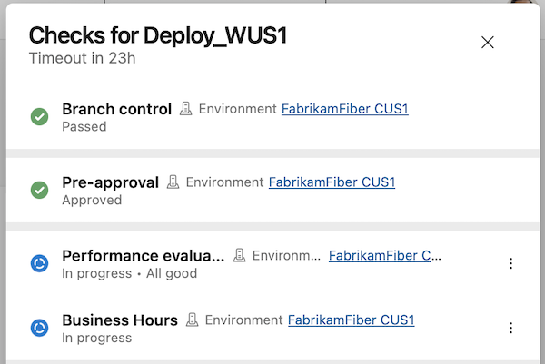


### Sequencing approvals and checks

With this sprint, you're able to specify the order in which approvals and checks run.

[Approvals and checks](/azure/devops/pipelines/process/approvals) allow you to control deployments to production. For example, you can specify that only pipelines that run on the `main` branch of a repository are allowed to use a production ARM service connection. Furthermore, you can require human approval and that the system passes a performance check.

Up until today, all approvals, and checks ran in parallel, except for exclusive lock. This meant that if your deployment process required performance checks to pass before manual approval is given, you couldn't enforce this in Azure Pipelines. You had to rely on approval instructions and internal process documentation.

With this sprint, we're introducing sequencing in Approvals and Checks. There are now five categories of Approvals and Checks:

1. Static checks: Branch control, Required template, and Evaluate artifact
2. Pre-dynamic checks Approval
3. Dynamic checks: Approval, Invoke Azure Function, Invoke REST API, Business Hours, Query Azure Monitor alerts
4. Post-dynamic checks Approval
5. Exclusive lock

> [!div class="mx-imgBorder"]
> 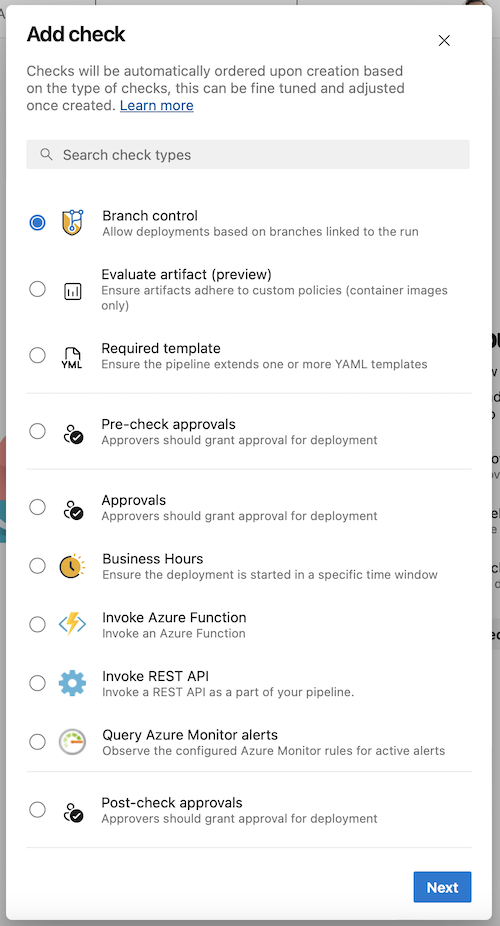

The order is shown also in the Approvals and checks tab.

> [!div class="mx-imgBorder"]
> 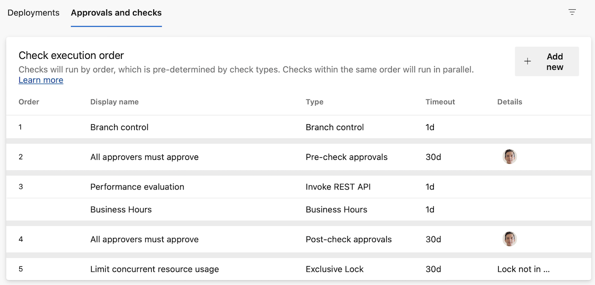

Within each category, the checks run in parallel. That is, if you have an Invoke Azure Function check and a Business hours check, they run at the same time.

> [!div class="mx-imgBorder"]
> 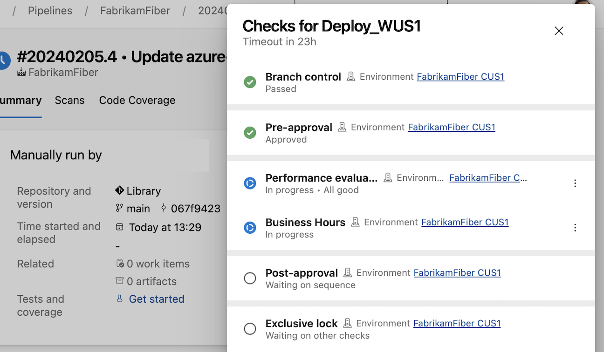

Check categories run one by one and if one fails, the rest of the checks aren't executed. This means that if you have a Branch control check and an Approval, if the Branch control fails, the Approval will fail, too. So no needless emails will be sent.

> [!div class="mx-imgBorder"]
> 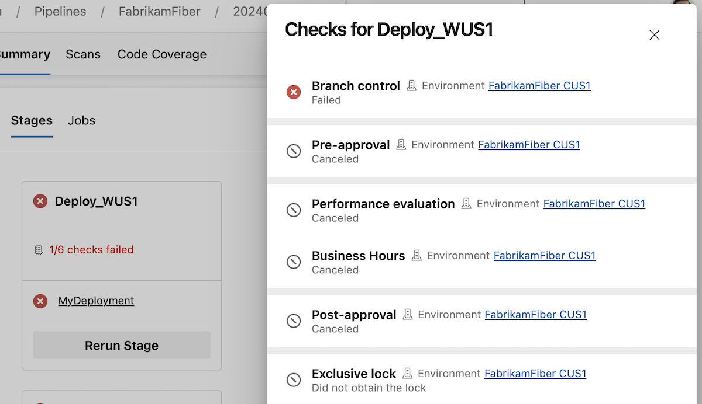

You can sign off on a deployment after all dynamic checks ran, using a post-dynamic checks Approval, or do a manual validation before proceeding with dynamic checks, using a pre-dynamic checks Approval.

### Validate and Save by default when editing YAML pipelines

An incorrect YAML pipeline can lead to wasted time and effort. To improve your pipeline editing productivity, we're changing the _Save_ button in the editor to also do YAML validation. 

> [!div class="mx-imgBorder"]
> 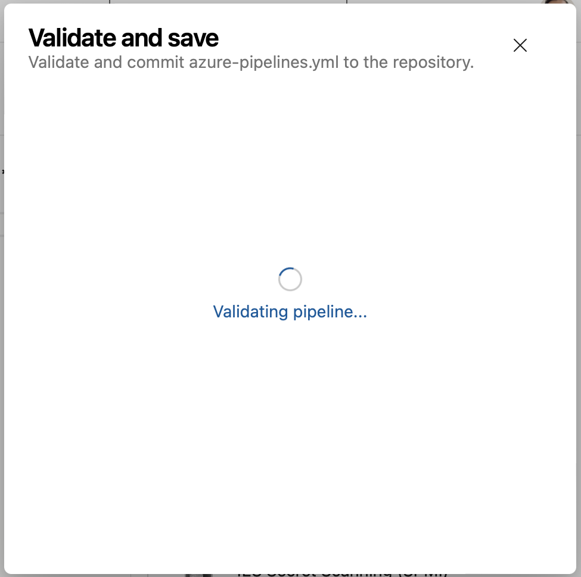

> [!div class="mx-imgBorder"]
> 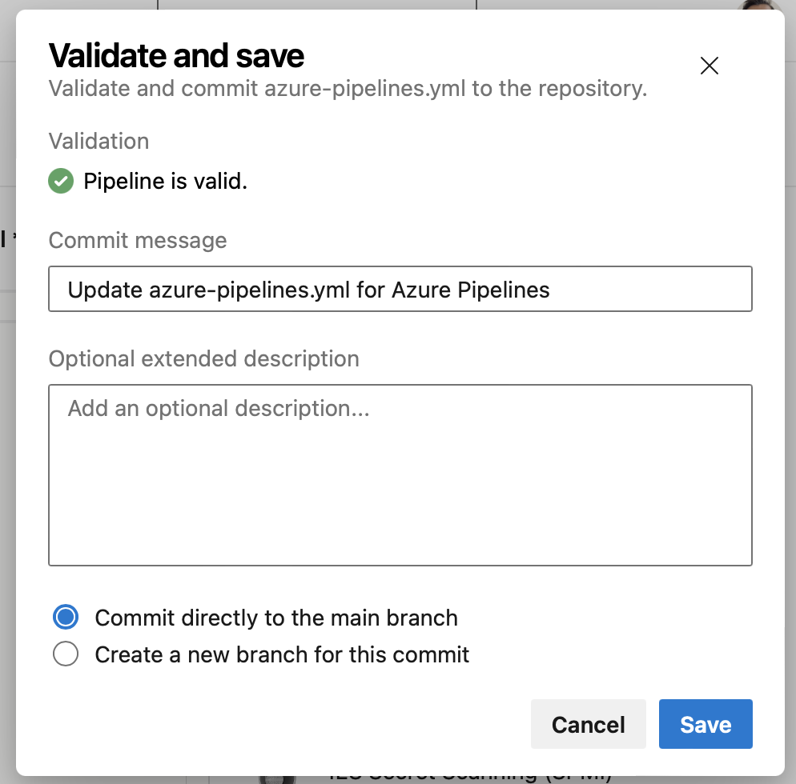

If your pipeline has errors, you'll still be able to save it.

> [!div class="mx-imgBorder"]
> 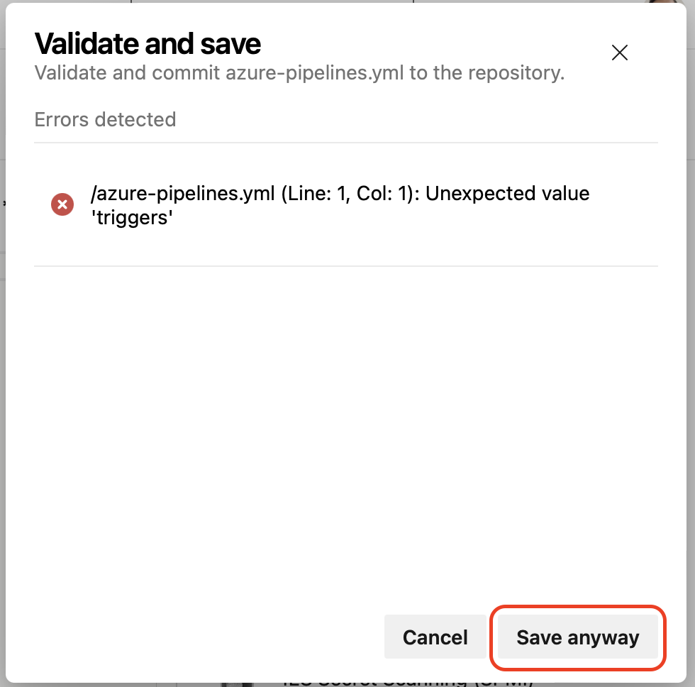

> [!div class="mx-imgBorder"]
> 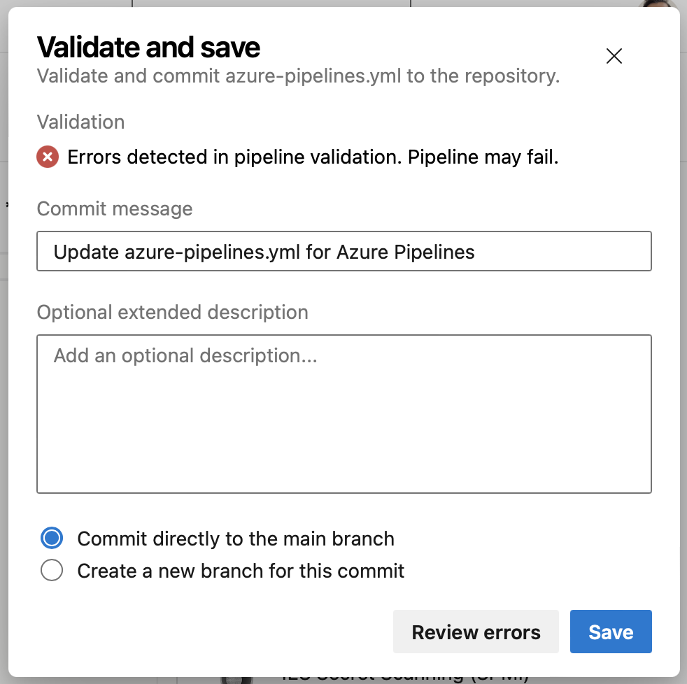


We also improved the _Validate_ experience, so you can see the errors in a list that's easier to understand.

> [!div class="mx-imgBorder"]
> 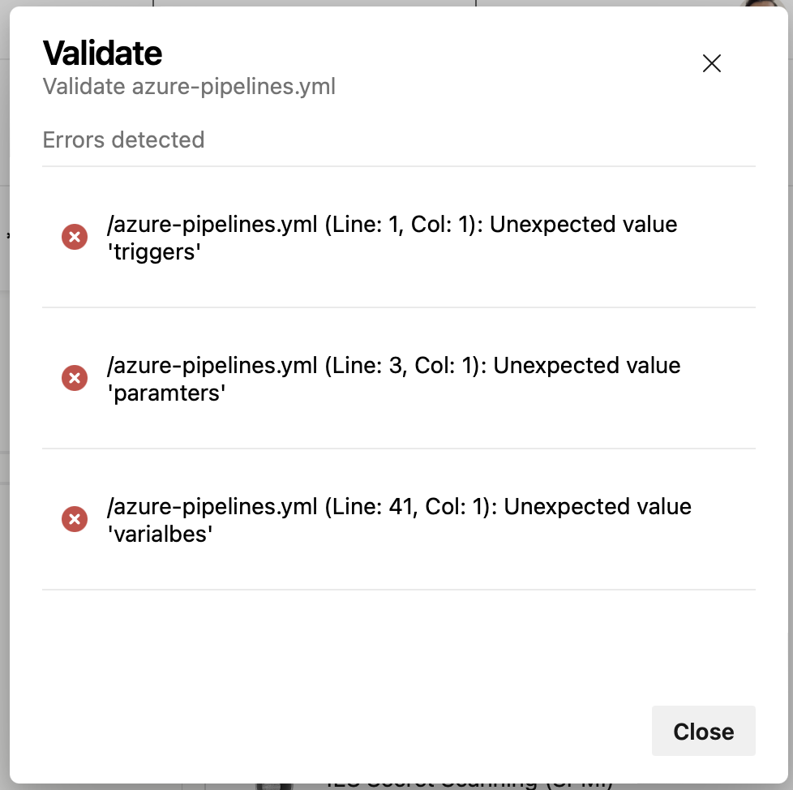


