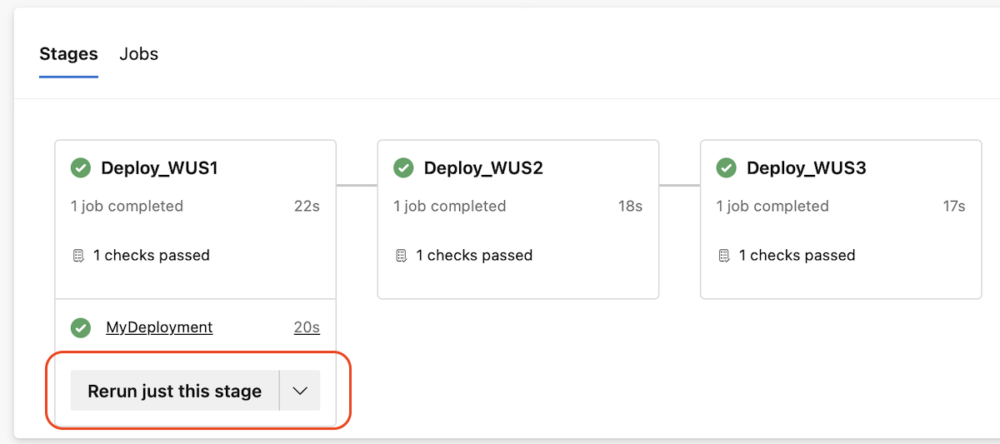
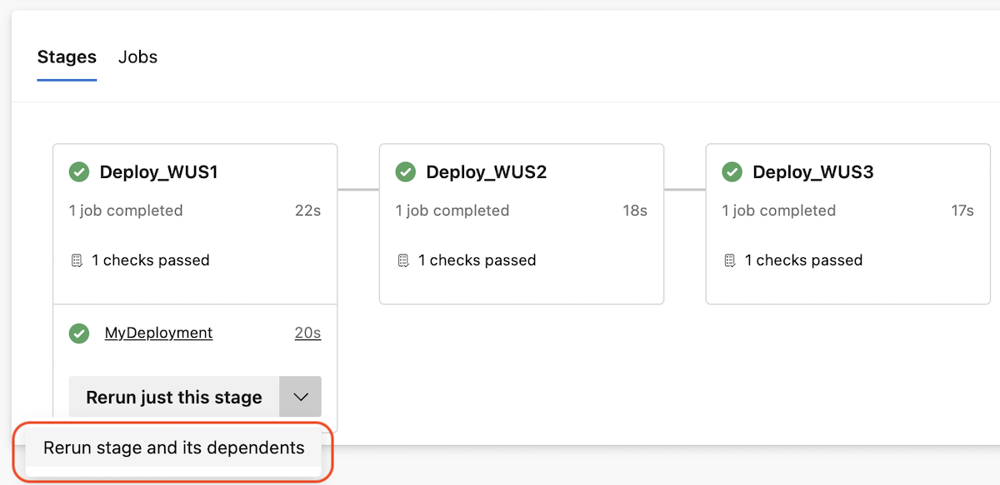

### Rerun a single stage

You can perform a rollback in YAML pipelines by rerunning a stage from a previous pipeline run that succeeded. 

With this sprint, you can rerun a single stage, without having to rerun its dependent stages. 

> [!div class="mx-imgBorder"]
> 

As before, you can still rerun a stage _and_ its dependent stages (if any).

> [!div class="mx-imgBorder"]
> 

