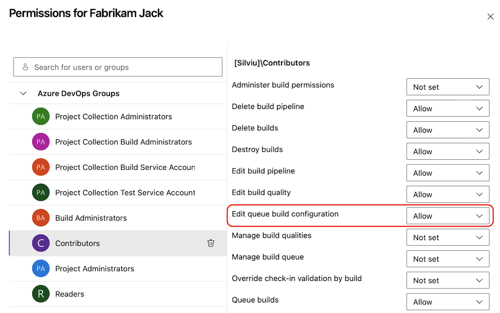
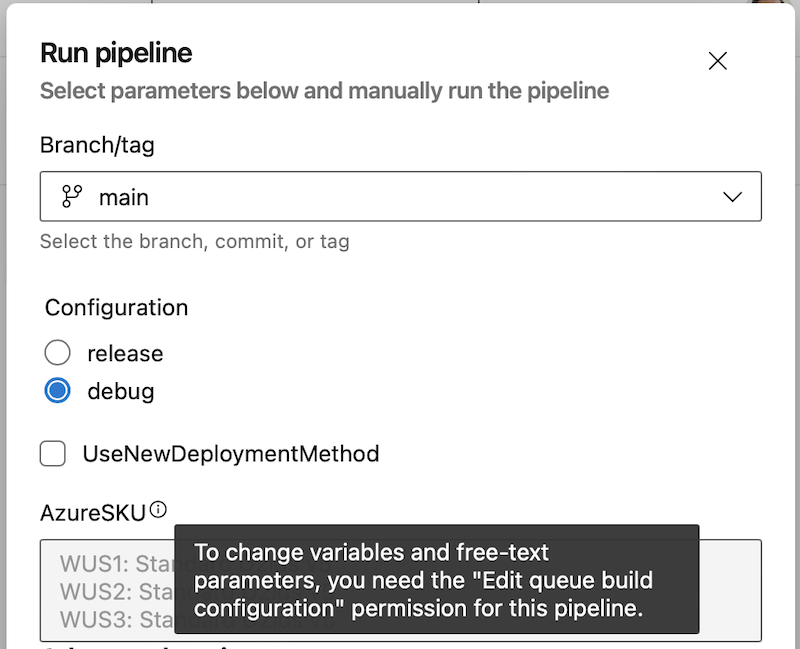
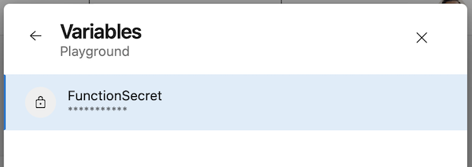

### Edit queue build configuration permission

To help you improve the security posture of your pipelines, we're adding a new pipeline permission named _Edit queue build configuration_ that controls who can define the values of variables settable at queue time and of free-text runtime parameters.

> [!div class="mx-imgBorder"]
> 

Variables settable at queue time and parameters allow you to write configurable YAML pipelines. Unfortunately, they also introduce the possibility of user input to be executed. The new permission mitigates this risk.

Users who have only _Queue build_ permission are able to queue builds and edit the values of runtime parameters that have a predefined set of values. That is, they're able to choose values for parameters that are of type `boolean`, `number` or they have the `values` property set.

If a parameter can contain free text, for example, is of type `object`, then only those users who have the _Edit queue build configuration_ permission are able to set it.

Consider a pipeline with the following parameters defined:
```yaml
parameters:
- name: Configuration
  type: string
  values:
  - release
  - debug
  default: debug
- name: UseNewDeploymentMethod
  type: boolean
  default: false
- name: AzureSKU
  type: object
  default:
    WUS1: Standard D2lds v5
    WUS2: Standard D2lds v5
    WUS3: Standard D2lds v5
```   

If a user queueing a run has only the _Queue build_ permission. When they queue the pipeline, they'll able to only specify the values of the `Configuration` and `UseNewDeploymentMethod` parameters. They wont be able to specify the value for the `AzureSKU` parameter.

> [!div class="mx-imgBorder"]
> 

Changing variables marked as settable at queue time also requires the  _Edit queue build configuration_ permission. Otherwise, one can't change the variable value.

> [!div class="mx-imgBorder"]
> 

To make sure the new permission doesn't interfere with your day-to-day workloads, everyone who has _Queue build_ permission receives the _Edit queue build configuration_ permission. Afterward, you can remove this permission as needed.

### TFX validates whether a task is using an EOL Node runner

Task authors use [TFX](https://learn.microsoft.com/azure/devops/extend/publish/command-line?view=azure-devops) to publish extensions. TFX has been updated to perform validations on other Node runner versions.

Extensions that contain tasks using a Node runner version that is end-of-life (EOL) (up to and including Node 16) will see this warning:

```
Task <TaskName> is dependent on a task runner that is end-of-life and are removed in the future. Authors should review Node upgrade guidance: https://aka.ms/node-runner-guidance.
```
