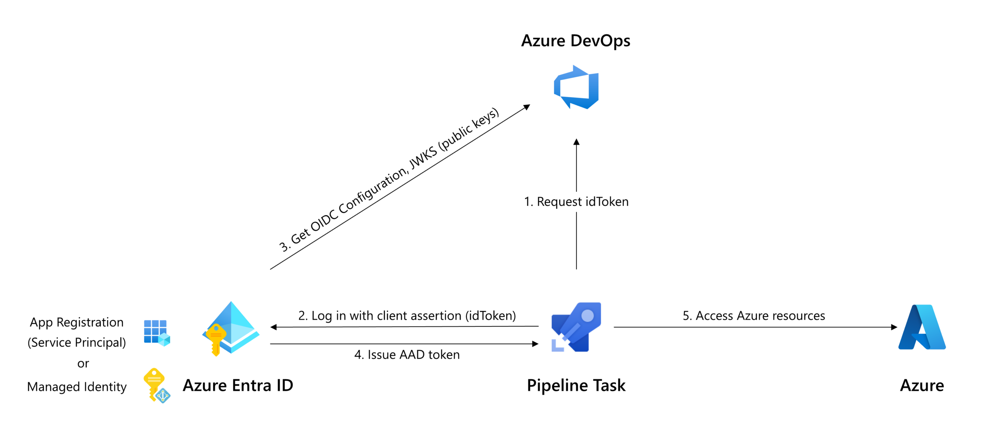

### Azure Pipelines tasks use Node 20

Tasks in the pipeline are executed using a runner, with Node.js used in most cases. Azure Pipelines tasks that utilize a Node as a runner now all use Node 20.

### Access Azure Bus from Pipelines using Entra ID authentication

You can now use [Entra ID authentication](/azure/service-bus-messaging/service-bus-authentication-and-authorization#microsoft-entra-id) to access Azure Service Bus from Azure Pipelines. This allows you to take advantage of Workload identity federation to remove secrets management and Azure RBAC for fine grained access control.

Identities accessing Azure Service Bus will need to be granted one of the [Azure built-in roles for Azure Service Bus](https://learn.microsoft.com/azure/service-bus-messaging/authenticate-application#azure-built-in-roles-for-azure-service-bus) on the Service Bus accessed.


## PublishToAzureServiceBus@2 task

The new PublishToAzureServiceBus@2 tasks can be configured using an Azure service connection. Create an [Azure service connection](https://learn.microsoft.com/azure/devops/pipelines/library/connect-to-azure?view=azure-devops) and populate the `serviceBusQueueName` and `serviceBusNamespace` properties of the new task:

```yaml
- task: PublishToAzureServiceBus@2
  inputs:
    azureSubscription: my-azure-service-connection
    serviceBusQueueName: my-service-bus-queue
    serviceBusNamespace: my-service-bus-namespace
    useDataContractSerializer: false
    messageBody: |
      {
        "foo": "bar"
      }
```


### Pipelines and tasks populate variables to customize Workload identity federation authentication

We now expose the REST API endpoint to request OIDC tokens in the `System.OidcRequestUri` pipeline variable. Task developers can use this variable to create an idToken and use that to authenticate with Entra ID.

If you are using a task from the Marketplace or a home-grown custom task to deploy to Azure, then it may not support workload identity federation yet. In these cases, we ask task developers to support workload identity federation to improve security.

> [!div class="mx-imgBorder"]
> 


Tasks that take a `connectedService:AzureRM` input in [task.json](https://learn.microsoft.com/azure/devops/extend/develop/integrate-build-task?view=azure-devops#custom-build-task-json) can be updated so support workload identity federation with the following steps:

*   Request an idToken using the [Oidctoken REST API](https://learn.microsoft.com/rest/api/azure/devops/distributedtask/oidctoken/create?view=azure-devops-rest-7.1) (arrow 1 in above diagram).
*   Exchange the idToken for an access token using the federated credential flow of the [OAuth API](https://learn.microsoft.com/azure/active-directory/develop/v2-oauth2-client-creds-grant-flow#third-case-access-token-request-with-a-federated-credential), specifying the idToken as `client_assertion` (arrows 2 & 4 in above diagram);  
    or:
*   For tasks that act as a wrapper around a tool that performs authentication itself, use the tools' authentication method to specify the federated token.

Node tasks can use the [azure-pipelines-tasks-artifacts-common](https://www.npmjs.com/package/azure-pipelines-tasks-artifacts-common?activeTab=explore) npm package to get the idToken, see [code example](https://github.com/microsoft/azure-pipelines-terraform/blob/main/Tasks/TerraformTask/TerraformTaskV4/src/id-token-generator.ts)


#### Requesting a fresh idToken

The `System.OidcRequestUri` pipeline variable and `AZURESUBSCRIPTION_SERVICE_CONNECTION_ID` environment variable exposed in the `AzureCLI@2` and `AzurePowerShell@5` tasks allow pipeline authors to authenticate from their own script:

#### PowerShell Az

```powershell
- task: AzurePowerShell@5
  inputs:
    azureSubscription: 'my-azure-subscription'
    scriptType: inlineScript
    inline: |        
      # Request fresh idToken
      Invoke-RestMethod -Headers @{
                        Authorization  = "Bearer $(System.AccessToken)"
                        'Content-Type' = 'application/json'
                      } `
                      -Uri "${env:SYSTEM_OIDCREQUESTURI}?api-version=7.1&serviceConnectionId=${env:AZURESUBSCRIPTION_SERVICE_CONNECTION_ID}" `
                      -Method Post `
                      | Select-Object -ExpandProperty oidcToken
                      | Set-Variable idToken

    # Fetch current context
    $azContext = Get-AzContext

    # Start new Az session
    Connect-AzAccount -ApplicationId $azContext.Account.Id `
                      -TenantId $azContext.Tenant.Id `
                      -SubscriptionId $azContext.Subscription.Id `
                      -FederatedToken $idToken
```

#### Azure CLI

```bash
- task: AzureCLI@2
  inputs:
    addSpnToEnvironment: true
    azureSubscription: 'my-azure-subscription'
    scriptType: bash
    scriptLocation: inlineScript
    inlineScript: |
      # Request fresh idToken
      OIDC_REQUEST_URL="${SYSTEM_OIDCREQUESTURI}?api-version=7.1&serviceConnectionId=${AZURESUBSCRIPTION_SERVICE_CONNECTION_ID}"
      ARM_OIDC_TOKEN=$(curl -s -H "Content-Length: 0" -H "Content-Type: application/json" -H "Authorization: Bearer $(System.AccessToken)" -X POST $OIDC_REQUEST_URL | jq -r '.oidcToken')

      # Save subscription context
      ARM_SUBSCRIPTION_ID=$(az account show --query id -o tsv)

      # New az-cli session
      az login --service-principal -u $servicePrincipalId --tenant $tenantId --allow-no-subscriptions --federated-token $ARM_OIDC_TOKEN
      az account set --subscription $ARM_SUBSCRIPTION_ID
```

### DockerCompose@0 uses Docker Compose v2 in v1 compatibility mode

Docker Compose v1 is end-of-life and will be removed from Hosted agents July 2024. We have updated the [DockerCompose@0](https://learn.microsoft.com/azure/devops/pipelines/tasks/reference/docker-compose-v0?view=azure-pipelines) task to use Docker Compose v2 in v1 compatibility mode instead.

### Tasks that use an end-of-life Node runner version to execute emit warnings

Pipeline tasks that are using Node version to execute that is no longer [maintained](https://nodejs.org/en/about/previous-releases) will start receiving warnings:

> Task `TaskName` version `<version>` is dependent on a Node version (10) that is end-of-life. Contact the extension owner for an updated version of the task. Task maintainers should review Node upgrade guidance: https://aka.ms/node-runner-guidance

Warnings can be suppressed at pipeline (job) or task level by setting an environment or pipeline variable e.g.

```yaml
variables:
  AZP_AGENT_CHECK_IF_TASK_NODE_RUNNER_IS_DEPRECATED: false
```
