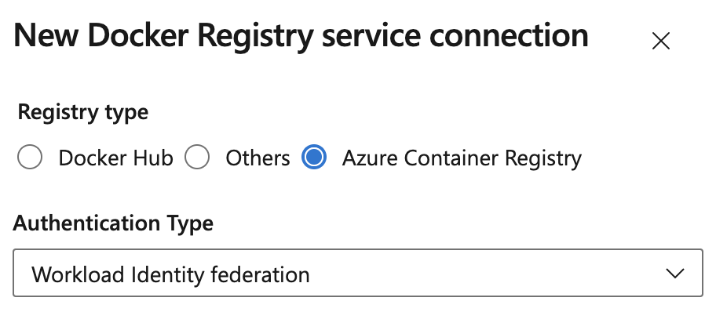

### Transitioning from AzureRM to the Az Module

AzureFileCopy, AzurePowerShell and SqlAzureDacpacDeployment tasks can no longer use AzureRM modules. As of February 2024, the AzureRM PowerShell module was deprecated and is no longer supported. While the AzureRM module may still function, it’s no longer maintained, placing any continued use at your discretion. We recommend transitioning to the [Az module](https://learn.microsoft.com/powershell/azure/migrate-from-azurerm-to-az?view=azps-12.0.0&preserve-view=true) for tasks accessing Azure. If you use tasks on self-hosted agents, please ensure the Az module is pre-installed on your images.

### Use Workload identity federation for container jobs, resources and tasks

Docker service connections targeting Azure Container Registry can now use Workload Identity Federation, eliminating the need for secrets. For an updated list of tasks supporting Workload Identity Federation, please refer to [our documentation](https://aka.ms/azdo-rm-workload-identity-tasks).

> [!div class="mx-imgBorder"]
> 
