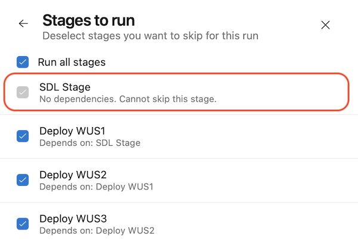

### Unskippable stages

You can use [YAML templates]() as a security mechanism, for example, to inject a stage that performs malware detection in all pipelines. However, Pipeline end users can choose which stages to run, potentially skipping the malware detection stage.

Starting with this sprint, you can mark a YAML stage as not skippable using the new `isSkippable` property. By default, the value of this property is `true`. To prevent skipping a stage set it to `false`, as shown in the example below:
``` yaml
- stage: sdl_check_stage
  displayName: SDL Stage
  isSkippable: false
  jobs:
  - job: sdl_check_job
    ...
```

These stages will always execute and can't be deselected in the _Stages to run_ configuration panel.

> [!div class="mx-imgBorder"]
> 