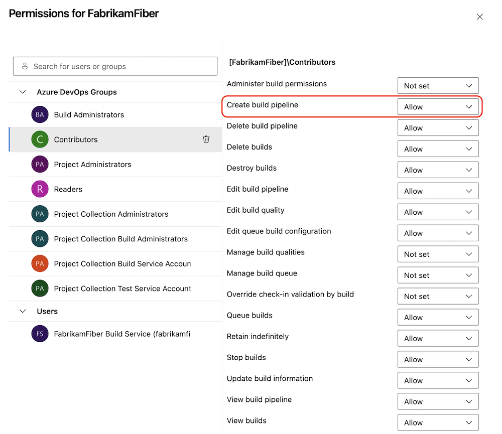
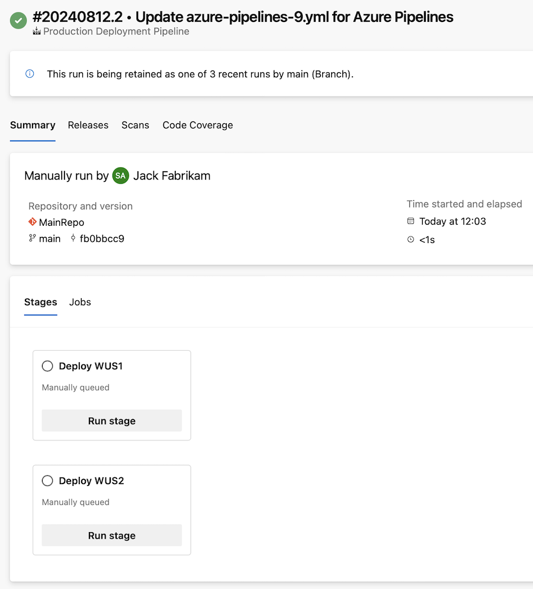

### Managed DevOps Pools (Preview)

Engineering teams excel when they can focus on writing code to develop applications and services for their users. However, in practice, a substantial amount of time is often spent managing other tasks, such as maintaining DevOps infrastructure. 

We're excited to announce the public preview of [Managed DevOps Pools (MDP)](https://aka.ms/mdp-docs), a new Azure DevOps feature designed to help development and platform engineering teams deploy custom DevOps pools tailored to their unique needs. MDP combines the flexibility of Scale Set agents with the ease of maintenance associated with Microsoft-hosted agents, enabling teams to establish consistency and best practices while optimizing performance, security, compliance, and cost-efficiency.

Key benefits of Managed DevOps Pools include:

* **Hosted on your behalf:** MDP is hosted and managed by Microsoft, with the virtual machines powering the agents created and maintained within Microsoft-owned Azure subscriptions.
* **Time spent in Management:** MDP significantly reduces the time spent managing agents, particularly those based on on-premises infrastructure or manually maintained systems.
* **Specific Pools:** Due to the ease with which new pools can be created, organizations can easily create multiple team-specific or workload-specific pools.
* **DevOps Billing:** MDP helps optimize a team’s DevOps bill through many features. It makes it easy for teams to find an optimal balance between a pool’s QoS/performance and cost.
* **Scalable:** MDP scales to 1000s of agents in a single pool.

Teams can create pools with [quick-starter images](https://learn.microsoft.com/azure/devops/managed-devops-pools/configure-images?view=azure-devops&tabs=azure-portal#azure-pipelines-images) that contain the same software present in Microsoft hosted agents or with images the team has created with pre-requisites that are unique to their scenario.

Learn more about Managed DevOps Pools by reading our [blog post](https://devblogs.microsoft.com/devops/managed-devops-pools/) or its [documentation](https://aka.ms/mdp-docs).


### Azure Pipelines tasks use Node 20

Most Pipeline tasks use Node as a runner. Azure Pipelines task that use NodeJS as a runner now all use NodeJS 20. Authors of task extensions should update their tasks to use Node 20. For guidance on how to upgrade see, [How can I upgrade my custom task to the latest Node?](https://aka.ms/node-runner-guidance). 

### Create build pipeline permission

To increase pipeline security, we're introducing a new permission, `Create build pipeline`, at Pipelines level. 

> [!div class="mx-imgBorder"]
> [](../../media/243-pipelines-01.png#lightbox)

Previously, the `Edit build pipeline` permission was required to create or edit a pipeline. This posed a security risk, as it allowed all users with the ability to create pipelines to also edit pipelines they didn't create. Preventing this was time-consuming.

To enhance your pipeline experience without compromising security, all users and groups with the `Edit build pipeline`  permission will now also receive the `Create build pipeline` permission.

When a pipeline is created, its creator is granted the `Edit build pipeline` permission.

For improved pipeline security, you may choose to remove the `Edit build pipeline` permission from user groups such as **Contributors** and **Readers**. This ensures that, by default, only the pipeline's creator can edit it.

> [!NOTE]  
> The **Edit build pipeline** permission does not prevent others from editing a YAML pipeline; it only protects the pipeline's properties from being edited.

For new projects, users and groups with the `Edit build pipeline` permission will also have the *`Create build pipeline`* permission. This is subject to change in the future.

### Exclusive lock check at stage level

Some use cases require a pipeline to access a specific resource only once at any given time. To support this case, we have the [Exclusive lock](https://learn.microsoft.com/azure/devops/pipelines/process/approvals?view=azure-devops&tabs=check-pass#exclusive-lock) check.

A similar situation arises when only one pipeline run should access a stage at any point in time. For instance, if you have a stage that deploys to an Azure resource group, you may want to prevent multiple pipeline runs from simultaneously updating the same resource group. Currently, achieving this requires using a proxy resource, such as an environment, and placing the Exclusive lock check on that environment. This approach can be time-consuming, add complexity, and increase maintenance efforts.

In this sprint, we’re introducing support for specifying the exclusive lock at the stage level. If you have a stage with an ID and specify its `lockBehavior` property, a lock is automatically created for that stage. The `sequential` behavior remains consistent for both resource-level and stage-level locks. However, the `runLatest` behavior differs, as it only cancels `runLatest` builds for the same branch, not for all branches of the pipeline.


### Template information in pipeline runs

We updated the [Pipelines Runs - Get](https://learn.microsoft.com/rest/api/azure/devops/pipelines/runs/get?view=azure-devops-rest-7.2#run) REST API with information about the templates extended and included in a pipeline run.

For example, consider you have the following YAML pipeline code:
```yml
extends:
  template: template-stages.yml@templates
  parameters:
    stages:
    - stage: deploy
      jobs:
      - job:
        steps:
        - template: template-step.yml
```

The new REST API has the following new properties:
```yml
"yamlDetails":
    {
        "extendedTemplates":
        [
            {
                "yamlFile": "template-stages.yml",
                "repoAlias": "templates"
            }
        ],
        "includedTemplates":
        [
            {
                "yamlFile": "template-step.yml",
                "repoAlias": "templates"
            }
        ],
        "rootYamlFile":
        {
            "ref": "refs/heads/main",
            "yamlFile": "azure-pipelines.yml",
            "repoAlias": "self"
        },
        "expandedYamlUrl": "https://dev.azure.com/fabrikamfiber/161cfeeb-d9fd-395c-917b-fec46db44fbb/_apis/build/builds/39224/logs/1"
    }
```

### Manually triggered YAML pipeline stages

We frequently receive requests about manually triggered YAML pipeline stages. These are helpful when you want a unified pipeline but don’t always want it to run to completion.

For instance, your pipeline might include stages for building, testing, deploying to a staging environment, and deploying to production. You might want all stages to run automatically except for the production deployment, which you prefer to trigger manually when ready.

With this sprint, we're adding support for manually triggered YAML pipeline stages. To use this feature, you need to add the `trigger: manual` property to a stage.

Consider the following YAML pipeline example:
```yaml
stages:
- stage: stage_WUS1
  displayName: Deploy WUS1
  trigger: manual
  jobs:
  - job: DeployJob
    steps:
    - task: AzureCLI@2
      inputs:
        azureSubscription: 'AzureWIF'
        scriptType: 'ps'
        scriptLocation: 'inlineScript'
        inlineScript: 'Write-host ''hello, world'''     
- stage: stage_WUS2
  displayName: Deploy WUS2
  trigger: manual
  jobs:
  - job: DeployJob
    steps:
    - task: AzureCLI@2
      inputs:
        azureSubscription: 'AzureWIF'
        scriptType: 'ps'
        scriptLocation: 'inlineScript'
        inlineScript: 'Write-host ''hello, world'''
```

When you run this pipeline, the experience is as follows:

> [!div class="mx-imgBorder"]
> 

Manually triggered stages have no dependencies and can be run at any time. The pipeline run completes when there are only manually triggered stages left to execute.