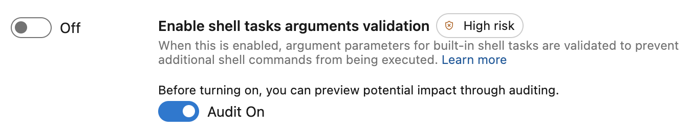

### Azure Pipeline agent v4 runs on .NET 8

The Azure Pipeline agent v3 currently uses .NET 6, but with the end-of-life for .NET 6 approaching, we're upgrading the agent to .NET 8. This update will be rolled out over the coming weeks.

If you're using self-hosted agents on an operating system that isn't supported by .NET 8, your agent won’t be upgraded to v4. Instead, pipelines running on unsupported operating systems display warnings in the pipeline logs. You can use the [QueryAgentPoolsForCompatibleOS.ps1 script](https://github.com/microsoft/azure-pipelines-agent/tree/master/tools/FindAgentsNotCompatibleWithAgent) to identify any pipeline agents running on outdated operating systems proactively.

The following operating system versions won't be supported by the updated v4 agent:

- Alpine Linux 3.13 - 3.16
- Debian 10
- Fedora 36 - 38
- macOS 10 & 11
- openSUSE 15.0 - 15.4
- Oracle Linux 7
- Red Hat Enterprise Linux 7
- SUSE Enterprise Linux 12
- Ubuntu, 16.04, 18.04
- Windows 7, 8 & 10 up to 21H2

### Preview mode for shell tasks arguments validation

Shell tasks such as [Bash@3](https://learn.microsoft.com/azure/devops/pipelines/tasks/reference/bash-v3?view=azure-pipelines), [BatchScript@1](https://learn.microsoft.com/azure/devops/pipelines/tasks/reference/batch-script-v1?view=azure-pipelines), [CmdLine@2](https://learn.microsoft.com/azure/devops/pipelines/tasks/reference/cmd-line-v2?view=azure-pipelines) and [PowerShell@2](https://learn.microsoft.com/azure/devops/pipelines/tasks/reference/powershell-v2?view=azure-pipelines) can be protected from command injection by enabling [shell tasks arguments validation](https://learn.microsoft.com/azure/devops/pipelines/security/inputs?view=azure-devops#enable-shell-tasks-arguments-parameter-validation) in organization or project settings.

Enabling shell tasks arguments validation can break existing scripts as input is rejected by input validation. For example, some characters are considered a command separator and rejected when this setting is enabled.

To make this transition smoother, we added a preview mode. With preview mode enabled, you receive warnings in your pipeline and audit logs, giving you visibility into potential issues without interrupting your tasks or workflows.

Go to Organization Settings > Pipelines > Settings > Task restrictions > Audit On:

> [!div class="mx-imgBorder"]
> 

### Revised naming convention for Azure service connections and App registrations

Previously, service connections were named using the format:`<azure devops org>-<azure devops project>-<azure subscription id>`. This made it challenging to correlate app registrations with corresponding service connections targeting the same Azure subscription. To improve clarity, app registration names now include the service connection name, following this format: `<azure devops org>-<azure devops project>-<service connection name>` for easier identification.