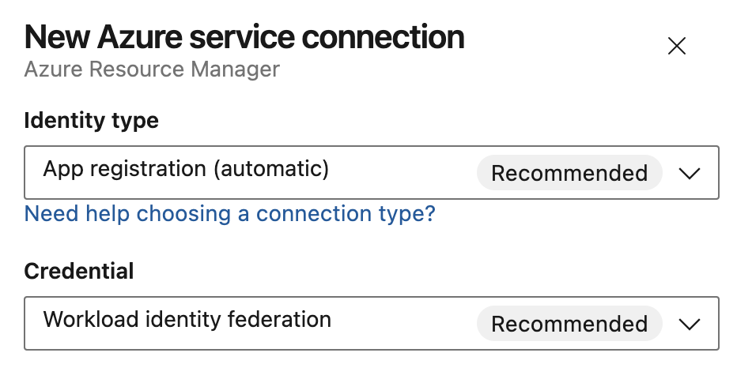
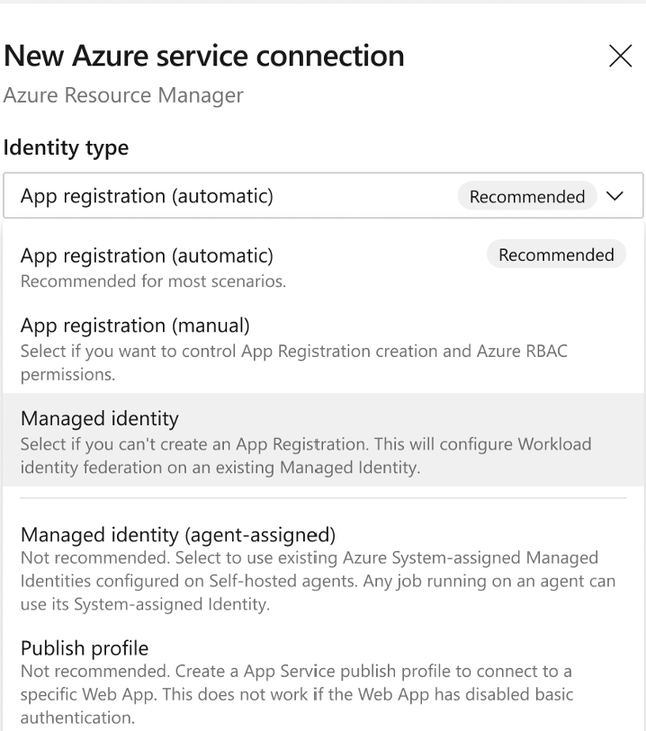
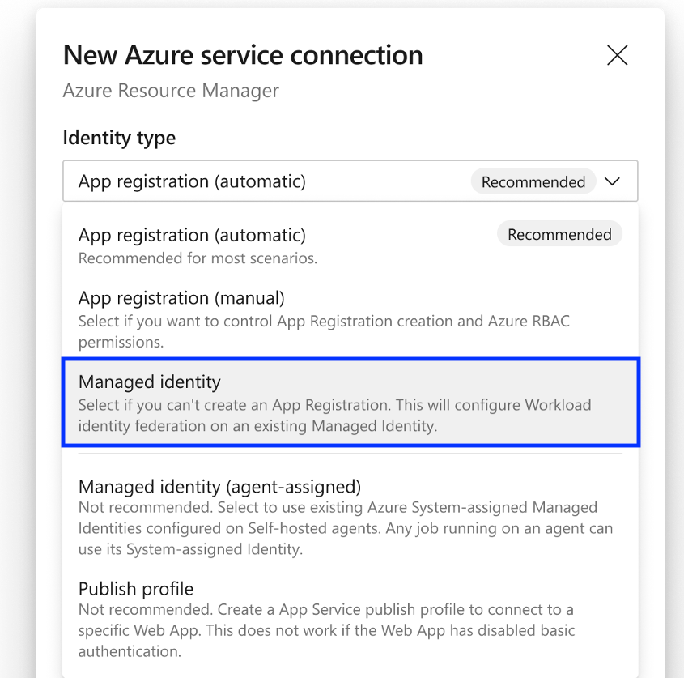
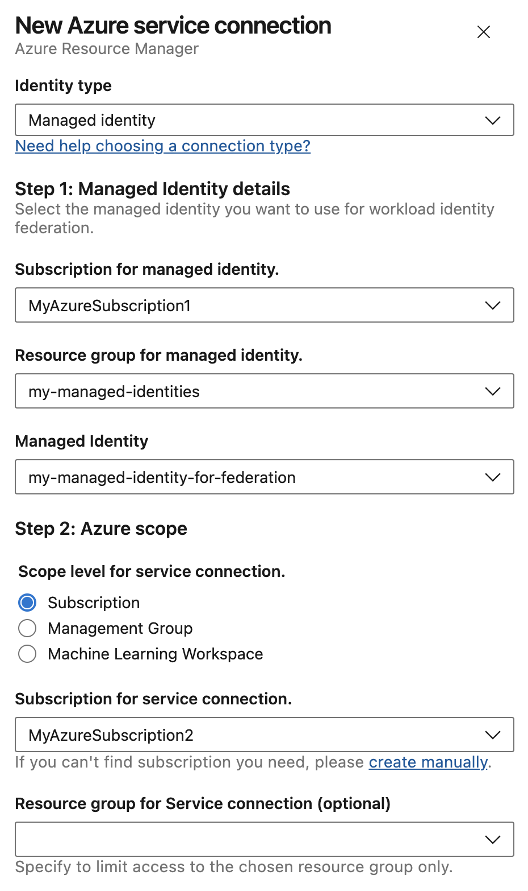
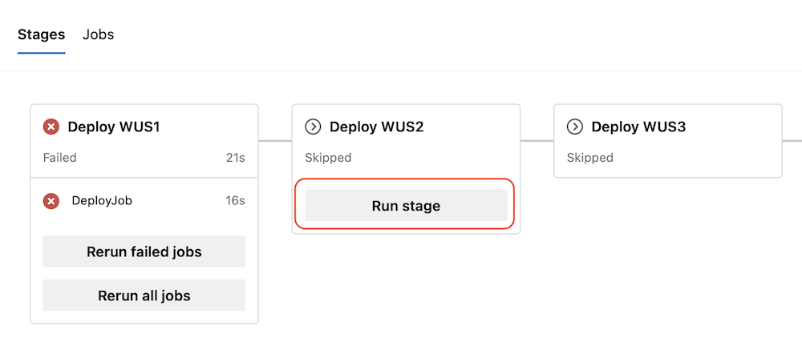

### Ubuntu 24.04 on Azure Pipelines Hosted agents

The Ubuntu 24.04 image is now available for Azure Pipelines hosted agents. To use this image, update your YAML file to include `vmImage:'ubuntu-24.04'`:  

```yaml
- job: ubuntu2404
  pool:
    vmImage: 'ubuntu-24.04'
  steps:
  - bash: |
      echo Hello from Ubuntu 24.04
      lsb_release -d
```

Please note, the ubuntu-latest image label will continue to point to ubuntu-22.04 until later this year. See the [Ubuntu 24.04 image readme](https://github.com/actions/runner-images/blob/main/images/ubuntu/Ubuntu2404-Readme.md) for installed software.


### Use Workload identity federation in Azure integration tests

In June, the The Azure Identity libraries for.NET, C++, Go, Java, JavaScript, and Python [added support for workload identity federation](https://devblogs.microsoft.com/azure-sdk/improve-security-posture-in-azure-service-connections-with-azurepipelinescredential/), so code executed from the [AzureCLI@2](/azure/devops/pipelines/tasks/reference/azure-cli-v2?view=azure-pipelines) and [AzurePowerShell@5](/azure/devops/pipelines/tasks/reference/azure-powershell-v5?view=azure-pipelines) tasks can authenticate with Entra (e.g. to access Azure) with the `AzurePipelinesCredential` class.

Many customers are using the Azure Identity libraries in integration tests invoked from other tasks. We have now added support for `AzurePipelinesCredential` to the [DotNetCoreCLI@2](/azure/devops/pipelines/tasks/reference/dotnet-core-cli-v2?view=azure-pipelines), [Maven@4](/azure/devops/pipelines/tasks/reference/maven-v4?view=azure-pipelines) and [VSTest@3](/azure/devops/pipelines/tasks/reference/vstest-v3?view=azure-pipelines) tasks.

You can set the `connectedService` property to an Azure service connection configured with workload identity federation. The `AzurePipelinesCredential` requires `SYSTEM_ACCESSTOKEN` to be set.

```yaml
- task: DotNetCoreCLI@2
  inputs:
    command: 'run'
    connectedService: <Azure service connection configured with workload identity federation>
  env:
    SYSTEM_ACCESSTOKEN: $(System.AccessToken)
```

For more information on `AzurePipelinesCredential`, see this [blog post](https://devblogs.microsoft.com/azure-sdk/improve-security-posture-in-azure-service-connections-with-azurepipelinescredential/).

### New Azure Service Connection Creation Experience with improved Managed Identity support

The new Azure service connection creation experience aligns terminology with Azure and Entra ID portals and provides increased flexibility and secure defaults.

When creating a new Azure Resource Manager service connection, the various options to configure identity are now available in a single dialog that replaces the distinct top level items used previously:

> [!div class="mx-imgBorder"]
> 

__Identity Type__ lists all authentication schemes the Azure service connection supports.

> [!div class="mx-imgBorder"]
> 

For app registrations, you can independently select __Credential__ to be [workload identity federation](https://devblogs.microsoft.com/devops/workload-identity-federation-for-azure-deployments-is-now-generally-available/) or a secret.

#### Azure Service Connection Managed Identity support

You can now select a pre-existing managed identity and use it to configure a service connection that uses workload identity federation. First, [create a User-assigned Managed Identity](/entra/identity/managed-identities-azure-resources/how-manage-user-assigned-managed-identities?pivots=identity-mi-methods-azp#create-a-user-assigned-managed-identity).

Then, create an Azure service connection and select the _Managed identity_ Identity Type. This will configure workload identity federation.  

> [!div class="mx-imgBorder"]
> 

The option to use a managed identity assigned to an agent (pool) has been renamed _Managed identity (agent-assigned)_. To prevent sharing over-privileged managed identities, it is recommended to use a managed identity with workload identity federation instead of managed identities assigned to agent pools.

Managed identity is also the recommended option for users who can't create an App registration if that is [disabled in Entra ID](https://learn.microsoft.com/entra/identity/role-based-access-control/delegate-app-roles#to-disable-the-default-ability-to-create-application-registrations-or-consent-to-applications).

To use a managed identity with workload identity federation, first select the subscription and resource group that holds your managed identity. This can be different from the subscription the service connection will access. Pick the managed identity that will be configured for workload identity federation. The user needs the [Managed Identity Contributor](/azure/role-based-access-control/built-in-roles/identity#managed-identity-contributor) role or equivalent permissions on the managed identity to create federated credentials on it.

Continue to select the subscription for that is used as the deployment scope for the service connection.

> [!div class="mx-imgBorder"]
> 

#### Service Management Reference field

Some organizations require the [Service Management Reference](https://learn.microsoft.com/graph/api/resources/application?view=graph-rest-1.0#properties) of an App registration to be populated with relevant context information from an ITSM database. If required to do so, users can specify this reference at service connection creation time.

#### More information

This new UX is rolling out over the next month. For more information, see:

- [Azure service connection documentation](/azure/devops/pipelines/library/connect-to-azure?view=azure-devops)
- [Workload identity federation](https://devblogs.microsoft.com/devops/workload-identity-federation-for-azure-deployments-is-now-generally-available/)
- [Troublespooting](https://aka.ms/azdo-rm-workload-identity-troubleshooting)

### Run children stages when parent stage fails

We made it easier to continue deployments using Azure Pipelines. This is useful, for example, when you use Pipelines to deploy new versions of your application across multiple Azure regions. 

Say you need to deploy to five consecutive Azure regions. Assume your pipeline has a stage for each region, and each stage has a job that runs an `AzureResourceManagerTemplateDeployment` task, and then it logs some telemetry. The latter is nice to have, but not critical. Imagine there is an issue logging the telemetry. Now, the stage fails and the deployment stops. 

Starting with this sprint, when a stage fails, you can resume running its children stages.

> [!div class="mx-imgBorder"]
> 