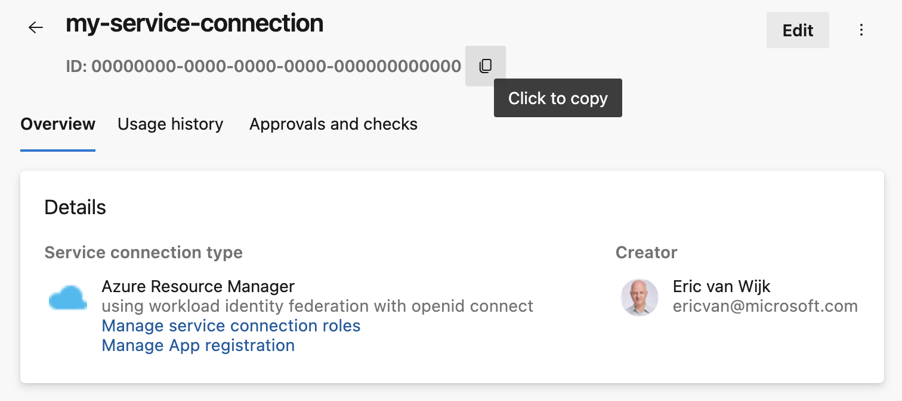

### macOS-15 Sequoia is available in preview

The `macOS-15` image is now available in preview for Azure Pipelines hosted agents. To use this image, update your YAML file to include `vmImage:'macos-15'`:  

```yaml
- job: macOS15
  pool:
    vmImage: 'macOS-15'
  steps:
  - bash: |
      echo Hello from macOS Sequoia Preview
      sw_vers
```

For macOS-15 installed software, see [image configuration](https://github.com/actions/runner-images/blob/main/images/macos/macos-15-Readme.md).

The `macOS-14` image will still be used when specifying `macOS-latest`. Once `macOS-15` is generally available, `macOS-latest` migrates directly to `macOS-15`.


### New naming convention for app registrations in Azure service connections

Previously, Service Connections were named using the format `<azure devops org>-<azure devops project>-<azure subscription id>`, making it challenging to distinguish between App registrations linked to the same Azure subscription. To improve clarity, App registration names will now include the Service Connection ID, following this format: `<azure devops org>-<azure devops project>-<service connection id>`.

You can find the service connection ID on the service connection details page:

> [!div class="mx-imgBorder"]
> 

### Azure Pipelines tasks use Node 20

Tasks that run on a pipeline agent are executed using a runner. The [Azure Pipelines tasks](/azure/devops/pipelines/tasks/reference) that use Node as a runner now all use Node 20.
