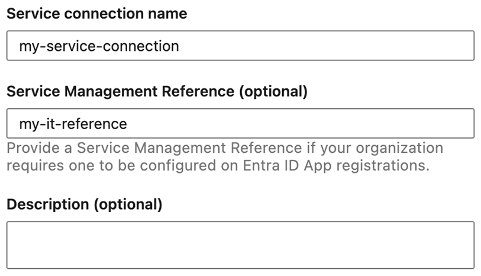
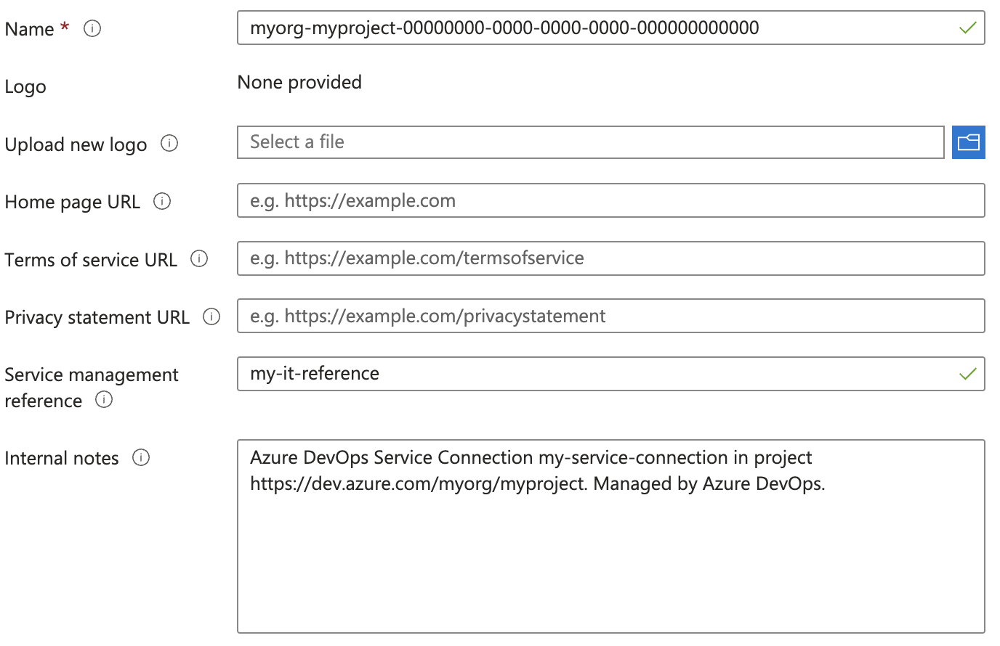

### macOS-15 Sequoia is available in preview

The `macOS-15` image is now available in preview for Azure Pipelines hosted agents. To use this image, update your YAML file to include `vmImage: 'macOS-15'`:  

```yaml
- job: macOS15
  pool:
    vmImage: 'macOS-15'
  steps:
  - bash: |
      echo Hello from macOS Sequoia Preview
      sw_vers
```

For macOS-15 installed software, see [image configuration](https://github.com/actions/runner-images/blob/main/images/macos/macos-15-Readme.md).

The `macOS-14` image will still be used when specifying `macOS-latest`. Once `macOS-15` is generally available, `macOS-latest` migrates directly to `macOS-15`.

### Improvements to service connection App registration attribution

When a service connection targets Azure, it automatically creates an App registration. 
To find the identity associated with a service connection, you can use the 'Manage App registration' link on the service connection details page. We received feedback that, when browsing App registrations directly in Microsoft Entra ID, it isn't always clear what an App registration is used for. 


To improve the attribution experience, we made the following changes:
##### App registration notes and service management reference

Newly created Azure service connections can now include a service management reference in addition to a description:

> [!div class="mx-imgBorder"]
> 

This information is used to populate App registration metadata that can be found on the Branding & properties blade:

> [!div class="mx-imgBorder"]
> 

If a description wasn’t provided during service connection creation, a default note will be added to the App registration.

##### New naming convention for App registrations in Azure service connections

Previously, service connections were named using the format `<azure devops org>-<azure devops project>-<azure subscription id>`, making it challenging to distinguish between App registrations linked to the same Azure subscription. To improve clarity, App registration names will now include the service connection ID, following this format: `<azure devops org>-<azure devops project>-<service connection id>`.

You can find the service connection ID on the service connection details page:

> [!div class="mx-imgBorder"]
> 

You can also follow or share the 'Manage App registration' link or 'Manage identity' if a [Managed Identity](/azure/devops/release-notes/2024/pipelines/sprint-246-update#azure-service-connection-managed-identity-support) is used.
