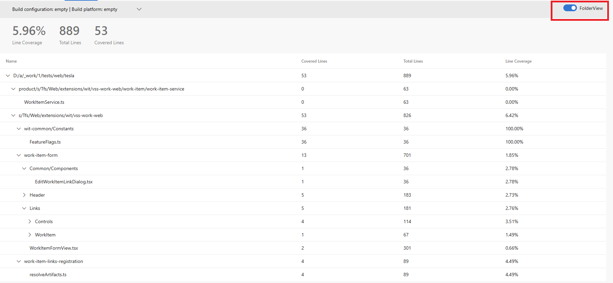

### Code Coverage results for folders

We've enhanced the tasks publishing the code coverage results. The results for the code coverage are now available for every individual file and folder rather than only as a top-level number. The code coverage view is by default in the Folder view mode. In that mode you can drill down and see the code coverage for that selected subtree. The below image shows how that is displayed.

Picture below shows the Folder / File level details of code coverage. As shown in the picture you can use the toggle button to switch between new and old views

> 
 