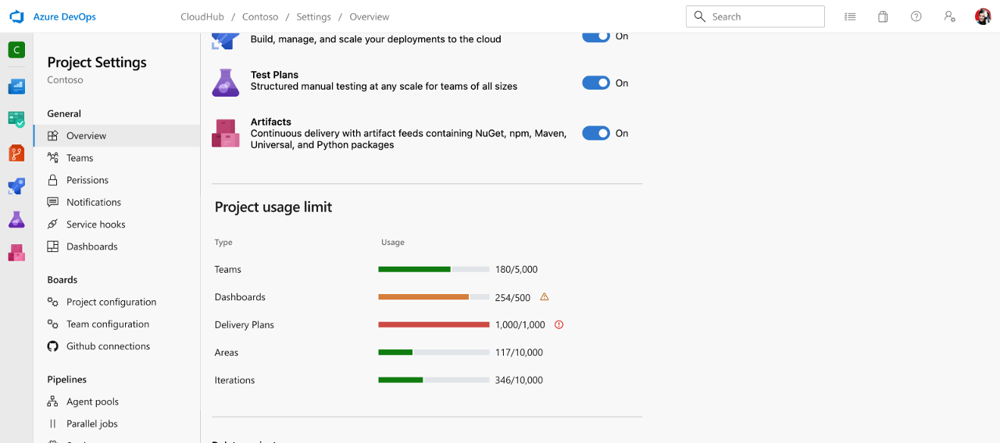

### Enhanced Visibility for Usage Limits in Azure DevOps 

We're excited to introduce the Object Limit Tracker in Azure DevOps. This new feature provides real-time visibility into resource usage for each organization and project directly within Azure DevOps, helping you manage limits proactively and avoid unexpected disruptions. Check out this new feature today to ensure uninterrupted productivity!

> 
 
