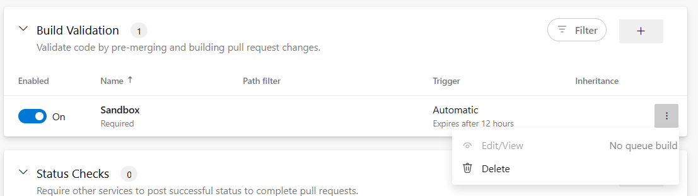
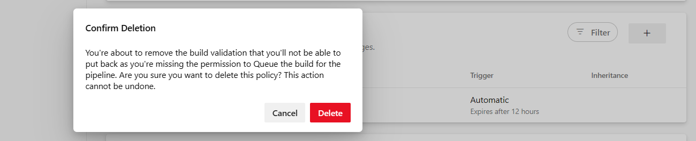

### Prevention for unauthorized users to configure pipeline as a Build Policy

Prevention for unauthorized users to configure pipeline as a Build Policy

Previously, when you've been adding a new build policy, you could configure to run any pipeline from the drop-down list (including the pipelines you had no **Queue builds** permission for). Similarly, you could edit the existing build policy even if that was configured to run the pipeline you had no **Queue builds** permission for. 

Now we're preventing users from doing so. If a user is denied to **Queue builds** permission for given pipeline, then that pipeline will be shown as disabled (greyed out) in the drop-down when adding new build policy. 

See the image below showing the pipeline named "Sandbox" with **Queue builds** permission being denied.

> [!div class="mx-imgBorder"]
> 

See the image below showing the pipeline named "Sandbox" disabled (greyed out) in the drop-down when user with denied **Queue builds** permission is trying to add new build policy.

> [!div class="mx-imgBorder"]
> 

When the build policy configured to run the pipeline named "Sandbox" already exists, then the user with no **Queue builds**  permission won't be able to edit or view the build policy. This case is shown on the following image.

> [!div class="mx-imgBorder"]
> 

When you try to delete this policy the pop-up dialog asking for deletion confirmation will be shown.

> [!div class="mx-imgBorder"]
> 

These changes also apply to any API calls that result in either creation or editing of the build policy. When any of these actions is run using a user identity with no **Queue builds** permission, then the call will fail returning back the appropriate error code and the error message saying `“TFS.WebApi.Exception: TF401027:` You need the QueueBuild permission on this pipeline to perform this action.”.

Deletion of a build policy done via API using a `user identity` with no **Queue builds** permission will succeed and there will be no warning or prevention done (no changes in how the deletion via API works).