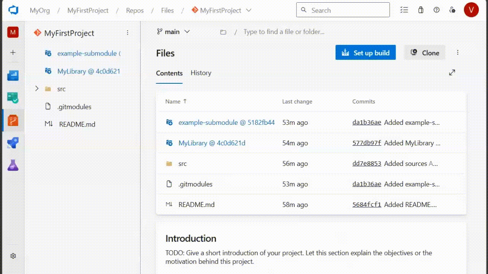

### UI support of Git submodules

Many teams actively use Git submodules to organize their codebase. We're excited to share that we've added support of Git submodules in the Files hub. Now you can instantly navigate to a submodule repository with just a single click, exactly to the specific commit referenced from your superproject. When used as a submodule, the following Git services are supported: Azure Repos, GitHub, GitLab and Bitbucket. Multiple URL formats specified in .gitmodules file are supported as well, including absolute HTTPS, SSH, and relative URLs.

This addresses a feature request from Developer Community: [[Azure DevOps Repos] Git submodule preview in UI](https://developercommunity.visualstudio.com/t/azure-devops-repos-git-submodule-preview-in-ui/1033995)

> [!div class="mx-imgBorder"]
> 
